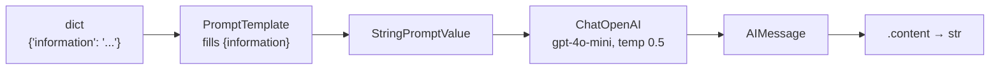

# Lesson 1 — Hello World: `Prompt → Model → Output`

> The smallest complete LangChain program: a prompt template, a chat model, and the pipe operator that fuses them into one runnable object.

| | |
|---|---|
| **Entry point** | [`main.py`](main.py) |
| **Bonus** | [`exercise_groq.py`](exercise_groq.py) (offline, no API key needed) |
| **Concepts** | `PromptTemplate`, `ChatModel`, LCEL `\|`, `Runnable`, `temperature`, provider swapping |
| **Requires** | `OPENAI_API_KEY` in `.env` (or a local Ollama daemon) |
| **Cost** | ~1 call to `gpt-4o-mini`, fractions of a cent |

---

## 1. What this lesson builds

A summariser. You hand it a block of biographical text about Elon Musk and it returns a short biography plus a list of notable achievements.

The task is deliberately trivial, because the point is not the task — it is the **shape** of a LangChain program. Every project later in this course is this same skeleton with more pieces bolted on:

```
                 lesson 1              lessons 2-3            lessons 5-6
              ┌────────────┐        ┌────────────┐        ┌────────────┐
   input ───► │  prompt    │  ───►  │  prompt    │  ───►  │  retriever │
              │  model     │        │  model     │        │  prompt    │
              └────────────┘        │  tools     │        │  model     │
                                    │  loop      │        │  parser    │
                                    └────────────┘        └────────────┘
```

## 2. Files

| File | Role |
|---|---|
| `main.py` | The chain: `PromptTemplate \| ChatOpenAI`, invoked once. |
| `exercise_groq.py` | A self-contained exercise on the `langchain-groq` integration pattern. Uses a **mock** `ChatGroq` class, so it runs offline with no key and no network. |

## 3. Data flow



Everything between `A` and `E` is a single object — `chain` — because `|` composes Runnables.

## 4. Code walkthrough

### 4.1 `load_dotenv()` — and why it must come first

```python
load_dotenv()
```

`ChatOpenAI` reads `OPENAI_API_KEY` **from `os.environ` at construction time**, not at call time. If `load_dotenv()` runs after the model object is built, you get an `OpenAIError: api key must be set` even though your `.env` is perfectly fine. This ordering trap reappears in every lesson.

### 4.2 `PromptTemplate` — why not just an f-string?

```python
summary_template = """
given the information {information} about the person, I want you to create:
...
"""

summary_prompt_template = PromptTemplate(
    input_variables=["information"],
    template=summary_template,
)
```

An f-string is evaluated immediately and produces a `str`. A `PromptTemplate` stays a *template*, and that buys three things:

1. **It is a `Runnable`** — so it can be piped into a model, batched, streamed, traced in LangSmith.
2. **It validates its inputs** — invoking with a missing or misspelled key raises instead of silently sending `{information}` verbatim to the model.
3. **It is serialisable** — prompts can be versioned, stored in LangSmith Hub, and swapped without touching the calling code.

`input_variables` must match the `{placeholders}` in the template exactly.

### 4.3 The chat model

```python
llm = ChatOpenAI(model_name="gpt-4o-mini", temperature=0.5)
# llm = ChatOllama(model="gemma3", temperature=0.5)
```

`temperature` controls sampling randomness:

| Value | Behaviour | Use for |
|---|---|---|
| `0.0` | Greedy decoding, near-deterministic | Extraction, classification, tool calling, RAG |
| `0.5` | Mild variation | Summaries, general assistants |
| `≥ 0.8` | Noticeably creative, less faithful | Brainstorming, copywriting |

The commented-out `ChatOllama` line is the important part of this section. Both classes implement the same `BaseChatModel` interface, so **switching from a paid cloud API to a free local model is a one-line change** and nothing downstream in the chain notices.

### 4.4 The pipe operator (LCEL)

```python
chain = summary_prompt_template | llm
```

`|` is overloaded on `Runnable` to build a `RunnableSequence`. The output type of the left side must match the input type of the right side — here `PromptValue`, which every chat model accepts.

Composition is the whole design of LangChain: the resulting `chain` is itself a `Runnable`, so it can be piped into an output parser, wrapped in a retry, put inside a graph node, and so on.

### 4.5 Invocation

```python
response = chain.invoke(input={"information": information})
print(response.content)
```

Because `chain` is a Runnable, you get four execution modes for free:

| Method | What it does |
|---|---|
| `.invoke(x)` | Single synchronous call |
| `.stream(x)` | Yields tokens as they are generated |
| `.batch([x1, x2])` | Parallel calls with automatic concurrency control |
| `.ainvoke(x)` | The async version of `invoke` |

`response` is an `AIMessage`. Besides `.content`, it carries `.response_metadata` (`token_usage`, `finish_reason`, `model_name`) and `.id` — useful for cost accounting.

## 5. The bonus exercise — `exercise_groq.py`

A fill-in-the-blanks exercise on the *integration pattern* shared by every LangChain provider package:

```python
os.environ["GROQ_API_KEY"] = api_key      # 1. credentials via env var
llm = ChatGroq(model="...", temperature=0) # 2. constructor takes model + params
llm.invoke([{"role": "user", "content": prompt}])  # 3. invoke takes a message LIST
.content                                   # 4. text lives on the response object
```

`ChatGroq` here is a **mock class defined in the file itself**, so nothing is sent over the network and no key is required. The signatures match the real `langchain_groq.ChatGroq` one-to-one, so the exercise transfers directly.

The last function, `implement_compare_models`, runs the same prompt through two model sizes — the cheapest reliable way to find the smallest model that is still good enough for your task.

## 6. How to run

```bash
uv run python LangChain/1.hello-world/main.py
```

The exercise needs no credentials at all:

```bash
uv run python LangChain/1.hello-world/exercise_groq.py
```

`.env` at the repository root:

```
OPENAI_API_KEY=sk-...
```

### Running it fully locally (free)

```bash
ollama pull gemma3
```

Then in `main.py` comment out the `ChatOpenAI` line and uncomment the `ChatOllama` one. Nothing else changes.

## 7. Expected output

```
Hello from langchain-course!
### 1. Brief Summary
Elon Reeve Musk, born June 28, 1971 in Pretoria, is a South African-born entrepreneur ...

### 2. Notable Achievements
- Founder, CEO and CTO of SpaceX ...
- CEO and product architect of Tesla ...
```

## 8. Gotchas

- **`model_name` vs `model`** — both work on `ChatOpenAI` (`model_name` is a validation alias), but `model` is the documented spelling and is what the rest of the course uses.
- **Single vs double braces** — `PromptTemplate` treats `{x}` as a variable. To emit a literal brace (JSON examples inside a prompt, for instance), double it: `{{`.
- **The source text is in Italian, the instructions are in English.** The model handles the mix and answers in English. Change the prompt to *"answer in Italian"* to see instruction-following override the language of the context.
- **Never print API keys.** Lesson 5 does it for debugging; do not copy that habit.

## 9. Exercises

1. Append `| StrOutputParser()` to the chain and delete `.content` from the print. (Introduced properly in lesson 5.)
2. Swap `.invoke()` for `.stream()` and print each chunk as it arrives.
3. Run the same prompt at `temperature=0` three times, then at `temperature=1.0` three times, and compare the variance.
4. Use `.batch()` to summarise three different people in parallel.
5. Read `response.response_metadata["token_usage"]` and compute the cost of the call.

---

**Next:** [Lesson 2 — ReAct search agent](../2.react-search-agent/README.md), where the model stops merely answering and starts *deciding to act*.
