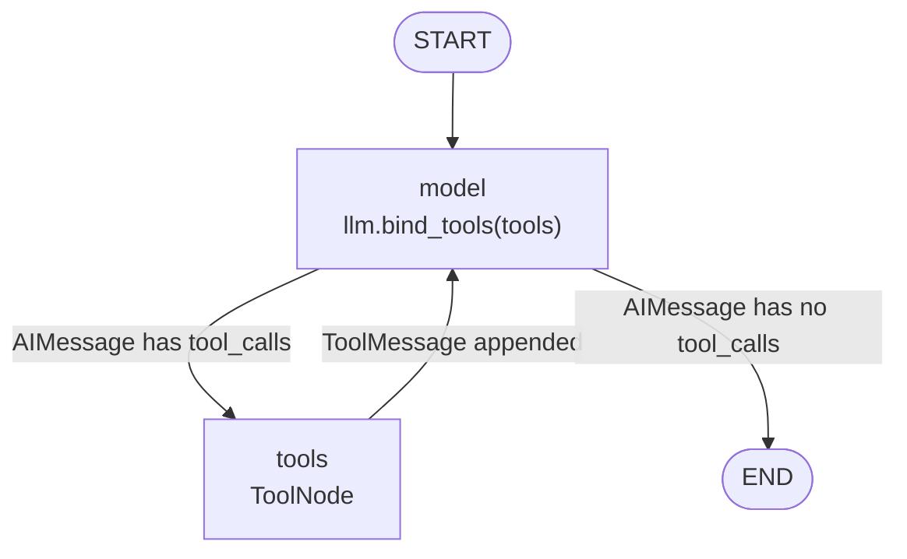

# Lesson 2 — ReAct Search Agent with `create_agent`

> The jump from *chain* to *agent*: the model stops being a text generator on rails and starts choosing which tool to call, with which arguments, and when to stop.

| | |
|---|---|
| **Entry point** | [`main.py`](main.py) |
| **Concepts** | `@tool`, tool schemas, `create_agent`, the ReAct loop, message transcripts, `TavilySearch` |
| **Requires** | `OPENAI_API_KEY`; `TAVILY_API_KEY` only for `main_tavily()` |
| **Cost** | 2–3 `gpt-4o-mini` calls per run |

---

## 1. Chain vs agent

| | Chain (lesson 1) | Agent (this lesson) |
|---|---|---|
| Control flow | Fixed, written by you | Decided by the model at runtime |
| Number of LLM calls | Exactly 1 | Unknown until it terminates |
| Can use external data | No | Yes, via tools |
| Output | `AIMessage` | A full message transcript |

An agent is a **loop**: call the model → if it requested a tool, run it and feed the result back → call the model again → stop when it answers in plain text instead of requesting a tool. That pattern is called **ReAct** (*Reason + Act*, [arXiv:2210.03629](https://arxiv.org/abs/2210.03629)).

This lesson gets the loop for free from `create_agent`. Lesson 4 rebuilds it by hand, three times, at three different levels of abstraction.

## 2. Files

| File | Role |
|---|---|
| `main.py` | Two functions, same agent, different tool backends: `main_tools()` (a stub tool) and `main_tavily()` (real web search). |

## 3. The graph `create_agent` builds



`create_agent` is not magic — it returns a **compiled LangGraph graph**. That is exactly the graph you will build node by node in `LangGraph/1.React-Agent-Function-Calling`.

## 4. Code walkthrough

### 4.1 Defining a tool

```python
@tool
def search(query: str) -> str:
    """
    A search tool that takes a query and returns the search results.
    """
    return f"Search results for '{query}'"
```

`@tool` reads three things out of the function and ships all of them to the model:

| Source in Python | Becomes | Seen by the model as |
|---|---|---|
| Function name | tool name | `"search"` |
| Docstring | tool description | *when* to use the tool |
| Type hints | JSON Schema | `{"query": {"type": "string"}}` |

The docstring is not documentation — **it is the prompt that decides whether the tool ever gets called.** A vague or missing docstring is the single most common reason an agent ignores a perfectly good tool.

> Note this particular `search` is a **stub**: it echoes the query back instead of searching. That is deliberate — run it and watch the model receive a useless observation and fall back on its own parametric knowledge.

### 4.2 Building the agent

```python
llm = ChatOpenAI(model_name="gpt-4o-mini", temperature=0.5)
tools = [search]
agent = create_agent(model=llm, tools=tools)
```

`create_agent(model, tools, ...)` wires up: `llm.bind_tools(tools)`, a `ToolNode` to execute calls, the conditional edge that tests for `tool_calls`, and the loop-back edge. Useful optional arguments (used in later lessons):

| Argument | Effect |
|---|---|
| `system_prompt=` | Prepends a system message on every model call (lesson 6) |
| `response_format=` | Forces a final structured answer (lesson 3) |
| `checkpointer=` | Persists state so the agent remembers across invocations |
| `middleware=` | Hooks before/after model and tool steps |

### 4.3 Invoking, and reading the result

```python
response = agent.invoke({"messages": HumanMessage(content="What is the capital of France?")})
print(response)
```

The agent's state is a **message list**, and `invoke` returns the whole transcript, not just the answer:

```
[ HumanMessage("What is the capital of France?"),
  AIMessage(content="", tool_calls=[{"name": "search", "args": {"query": "capital of France"}, "id": "call_abc"}]),
  ToolMessage(content="Search results for 'capital of France'", tool_call_id="call_abc"),
  AIMessage(content="The capital of France is Paris.") ]
```

Read the answer with:

```python
print(response["messages"][-1].content)
```

Note the second element: an `AIMessage` with **empty `content` and a populated `tool_calls`**. That is what "the model decided to act" physically looks like.

### 4.4 Swapping in a real search tool

```python
tools = [TavilySearch()]
agent = create_agent(model=llm, tools=tools)   # identical line
```

`TavilySearch` is a prebuilt tool: name, description and schema are already defined, so it drops straight into the list. Tavily is a search API built for LLMs — it returns cleaned, ranked text plus source URLs instead of raw HTML you would have to strip yourself.

**The agent code does not change at all.** Tools are pluggable; that is the entire architectural payoff.

## 5. How to run

```bash
uv run python LangChain/2.react-search-agent/main.py
```

Toggle the two calls at the bottom of the file to compare backends:

```python
if __name__ == "__main__":
    main_tools()
    #main_tavily()
```

`.env` at the repository root:

```
OPENAI_API_KEY=sk-...
TAVILY_API_KEY=tvly-...   # only needed for main_tavily()
```

## 6. What to look for when you run it

Run **both** functions on the same question and diff the transcripts:

| | `main_tools()` (stub) | `main_tavily()` (real) |
|---|---|---|
| Tool result | `"Search results for 'capital of France'"` | Real snippets + URLs |
| Final answer | Correct, but from the model's memory | Correct **and** grounded |
| Verifiable? | No | Yes — sources are in the transcript |

This contrast is the whole reason RAG exists (lessons 5 and 6).

## 7. Gotchas

- **`temperature=0.5` for an agent is high.** Tool arguments should be deterministic; production agents run at `0`. Lesson 4 uses `0`.
- **A `HumanMessage` is accepted where a list is expected.** LangGraph coerces a single message into `[message]`. Passing a list explicitly is clearer.
- **No iteration cap here.** `create_agent` has an internal recursion limit (`recursion_limit`, default 25) that raises `GraphRecursionError`. Lesson 4 makes the cap explicit with `MAX_ITERATIONS`.
- **Tools run with your process's privileges.** `@tool` on a function that shells out or writes to a database means the *model* is choosing those arguments. Validate inputs inside the tool.

## 8. Exercises

1. Print only `response["messages"][-1].content`, then loop over all messages and print `type(m).__name__` to see the loop's shape.
2. Give `search` a much more specific docstring and observe whether the model calls it more eagerly.
3. Add a second tool (e.g. `multiply(a: float, b: float)`) and ask a question that needs both — watch the loop run twice.
4. Set `temperature=0` and re-run the same question five times; compare the stability of the tool arguments.
5. Pass `system_prompt="Always use a tool before answering."` and see how the behaviour changes.

---

**Previous:** [Lesson 1 — Hello World](../1.hello-world/README.md) · **Next:** [Lesson 3 — Structured search agent](../3.search-agent/README.md)
