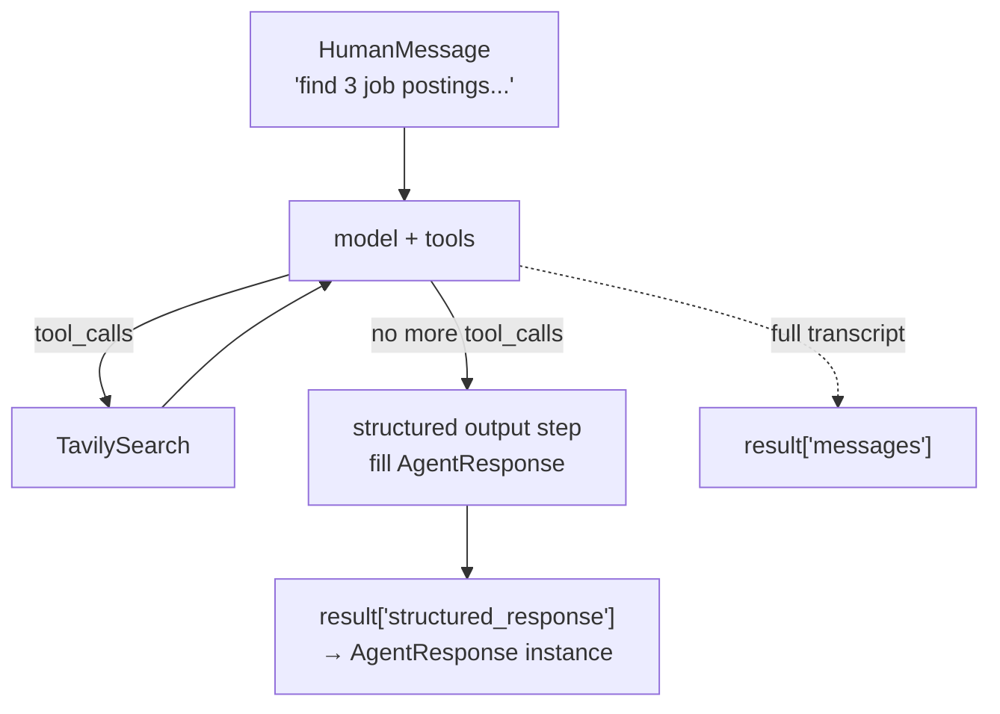

# Lesson 3 — Search Agent with Structured Output

> An agent whose answer is a **validated Python object**, not a paragraph you have to regex. This is the difference between a demo and something you can put behind an API.

| | |
|---|---|
| **Entry point** | [`main.py`](main.py) |
| **Concepts** | Pydantic schemas as prompts, `response_format=`, `structured_response`, nested models, constrained decoding |
| **Requires** | `OPENAI_API_KEY`, `TAVILY_API_KEY` |
| **Cost** | 3–5 `gpt-4o-mini` calls + 1–3 Tavily searches |

---

## 1. The problem this lesson solves

Lesson 2's agent returns prose:

```
"I found three roles. The first is at Anthropic, posted 2 days ago, and the link is
https://linkedin.com/... The second one..."
```

To render that in a UI or write it to a database you would have to parse free text — brittle, and it breaks the moment the model rephrases. What you actually want is:

```python
AgentResponse(
    answer="Three AI engineer roles using LangChain in the Bay Area: ...",
    sources=[Source(url="https://linkedin.com/jobs/view/..."),
             Source(url="https://linkedin.com/jobs/view/...")]
)
```

Typed, validated, indexable. That is what `response_format` gives you.

## 2. Files

| File | Role |
|---|---|
| `main.py` | Schemas (`Source`, `AgentResponse`), the agent built at module level, and a `main()` that asks a multi-step research question. |

## 3. Flow



`response_format` adds the **`S` node**: once the ReAct loop settles, one extra constrained call forces the model to serialise its answer into your schema. The result is parsed and validated by Pydantic before you ever see it.

## 4. Code walkthrough

### 4.1 The schemas *are* prompt engineering

```python
class Source(BaseModel):
    """Schema for a source used by the agent"""
    url: str = Field(description="The URL of the source")


class AgentResponse(BaseModel):
    """Schema for agent response with answer and sources"""
    answer: str = Field(description="Thr agent's answer to the query")
    sources: List[Source] = Field(
        default_factory=list,
        description="List of sources used to generate the answer"
    )
```

Three things are doing real work here, and none of them are type checking:

| Element | Where it ends up |
|---|---|
| Class docstring | The schema's `description` — tells the model what the object *is* |
| `Field(description=...)` | Per-property description in the JSON Schema — the only instruction the model gets about what to put in that field |
| The type itself (`str`, `List[Source]`) | Hard structural constraint on the generated JSON |

`default_factory=list` makes `sources` effectively optional: an answer with no sources still validates instead of raising. Choose deliberately — required fields *force* the model to produce content for them (a trick used aggressively in the Reflexion lesson).

**Nested models are supported.** `List[Source]` becomes an array of objects. Prefer `List[Source]` over `List[str]`: it leaves room to add `title`, `published_at`, `snippet` later without breaking consumers.

### 4.2 Module-level construction

```python
load_dotenv()
...
llm = ChatOpenAI(model="gpt-4o-mini", temperature=0.5)
tools = [TavilySearch()]
agent = create_agent(model=llm, tools=tools, response_format=AgentResponse)
```

The agent is built **once at import time**, not per call. That matters: `create_agent` compiles a graph, and recompiling it on every request is pure overhead. (Lesson 6 does rebuild per call — noted there as something to fix.)

This is also why `load_dotenv()` sits between the imports: the module-level `ChatOpenAI` and `TavilySearch()` need the keys in the environment before they are constructed.

### 4.3 Reading the result

```python
result = agent.invoke({"messages": HumanMessage(content="search for 3 job postings ...")})
```

`result` is a dict with two keys worth knowing:

| Key | Contents |
|---|---|
| `result["messages"]` | The full transcript: human turn, tool calls, tool results, final AI turn |
| `result["structured_response"]` | An **`AgentResponse` instance**, already validated |

So the useful lines are:

```python
resp = result["structured_response"]
print(resp.answer)
for s in resp.sources:
    print(s.url)
print(resp.model_dump_json(indent=2))   # ready to return from a FastAPI endpoint
```

The script as written prints the raw `result`, which is fine for inspection but is the first thing you would change in real code.

### 4.4 Why the query is a good test

> *"search for 3 job postings for an ai engineer using langchain in the bay area on linkedin and list their details"*

It forces several behaviours at once: multiple searches, reading and filtering results, aggregating across pages, respecting a count constraint (3), and finally compressing everything into a fixed schema. A single-hop question would not exercise the loop.

## 5. How to run

```bash
uv run python LangChain/3.search-agent/main.py
```

`.env` at the repository root:

```
OPENAI_API_KEY=sk-...
TAVILY_API_KEY=tvly-...
```

## 6. Gotchas

- **The model can still be wrong — it just cannot be malformed.** Structured output guarantees the *shape*, never the *truth*. A hallucinated URL validates perfectly against `url: str`. Tighten it with `HttpUrl` from Pydantic, or verify the URLs yourself.
- **Descriptions are prompts.** If a field is filled badly, rewrite its `description` before you touch the system prompt.
- **`temperature=0.5` is still high** for a research agent. `0` gives steadier tool arguments and steadier field extraction.
- **Deep or heavily-nested schemas degrade quality.** Two or three levels is the practical ceiling; beyond that, split into several tool calls.
- **The typo `"Thr agent's answer"`** in a `Field(description=...)` is harmless here, but treat these strings with the same care as any prompt.

## 7. Exercises

1. Replace `print(result)` with the `structured_response` accessors shown in §4.3.
2. Add `title: str` and `posted_days_ago: int | None` to `Source` and re-run.
3. Change `url: str` to `url: HttpUrl` and observe what happens when the model invents a malformed link.
4. Make `sources` required (drop `default_factory`) and see whether the model becomes more diligent about citing.
5. Wrap the agent in a FastAPI endpoint returning `resp.model_dump()` — it works with zero glue code, which is the point of this lesson.

---

**Previous:** [Lesson 2 — ReAct search agent](../2.react-search-agent/README.md) · **Next:** [Lesson 4 — Agents under the hood](../4.agents-under-the-hood/README.md)
