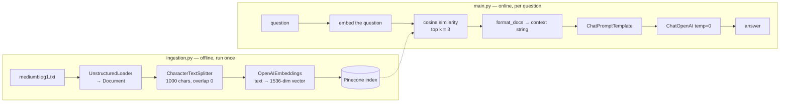

# Lesson 5 — RAG, the Gist

> Retrieval-Augmented Generation reduced to its essentials: turn a text file into vectors, find the 3 chunks nearest to a question, paste them into a prompt. Then the same thing written three ways, so you can see what LCEL actually buys you.

| | |
|---|---|
| **Entry points** | [`ingestion.py`](ingestion.py) (run once) → [`main.py`](main.py) |
| **Concepts** | Embeddings, chunking, vector stores, similarity search, retrievers, LCEL, `RunnablePassthrough.assign`, `StrOutputParser` |
| **Requires** | `OPENAI_API_KEY`, `PINECONE_API_KEY`, `INDEX_NAME` |
| **Cost** | Embedding ~15 chunks + 3 `gpt-4o-mini` calls |

---

## 1. Why RAG exists

An LLM only knows what was in its training data. It cannot answer about your PDFs, your Confluence, or anything published after its cutoff — and when it does not know, it tends to invent something plausible.

RAG fixes this by changing the question from *"what do you know about X?"* to *"here are 3 relevant paragraphs; answer using only these."*

`main.py` makes the difference measurable: **Implementation 0 answers the same question with no retrieval at all.** Run it and compare — that contrast is the lesson.

## 2. The two phases



**The two phases must agree on the embedding model.** Ingest with one model and query with another and the vectors live in different geometric spaces — retrieval returns nonsense with no error message.

## 3. Files

| File | Role |
|---|---|
| `ingestion.py` | LOAD → SPLIT → EMBED → STORE. Run once, before anything else. |
| `main.py` | Three implementations of the query side: no RAG, manual RAG, LCEL RAG. |
| `mediumblog1.txt` | The corpus: a ~400-line Medium article on vector databases. |

## 4. `ingestion.py` — building the index

### 4.1 Load

```python
loader = UnstructuredLoader(file_path, chunking_strategy="basic",
                            max_characters=1000000, encoding="utf-8")
document = loader.load()      # → List[Document]
```

`UnstructuredLoader` handles ~60 formats (PDF, HTML, DOCX, PPTX…) behind one API, so the rest of the pipeline is unchanged when the source type changes. `max_characters` is set absurdly high on purpose: we want **one** `Document` out of the loader and want `CharacterTextSplitter` to own the chunking policy.

A `Document` is just `page_content: str` + `metadata: dict`.

### 4.2 Split

```python
text_splitter = CharacterTextSplitter(chunk_size=1000, chunk_overlap=0)
texts = text_splitter.split_documents(document)
```

Chunk size is *the* RAG trade-off:

| Chunk size | Effect |
|---|---|
| Too small (< 300) | Each vector is precise but context-free; answers become fragmentary |
| Too large (> 2000) | The embedding averages several topics and stops matching anything sharply; wastes prompt tokens |
| ~500–1500 | The usual sweet spot for prose |

`chunk_overlap=0` is the simple case. Overlap (100–200 chars) exists because the sentence that answers your question is eventually going to fall exactly on a chunk boundary. Lesson 6 uses `chunk_overlap=200`.

### 4.3 Embed

```python
embeddings = OpenAIEmbeddings(openai_api_key=OPENAI_API_KEY)
```

The default model (`text-embedding-ada-002`) produces **1536-dimensional** vectors. Semantically similar text lands close together, which is what makes "find the relevant chunk" a geometry problem instead of a keyword problem.

### 4.4 Store

```python
vector_store = PineconeVectorStore.from_documents(
    texts, embeddings, index_name=os.environ.get("INDEX_NAME")
)
```

`from_documents` embeds every chunk and upserts it into an **existing** Pinecone index. Create the index first in the Pinecone console:

| Setting | Value |
|---|---|
| Dimension | `1536` |
| Metric | `cosine` |

> ⚠️ Re-running `ingestion.py` **appends duplicates** — it does not reset the index. Delete and recreate the index between runs.

> ⚠️ Lines 20–22 print your live API keys to stdout. Fine in a local sandbox, unacceptable anywhere logs are collected. Delete them before reusing this file.

## 5. `main.py` — three ways to ask

### Implementation 0 — no RAG (the baseline)

```python
result_raw = llm.invoke([HumanMessage(content=query)])
```

The model answers from parametric memory. Depending on the question, you get something generic, outdated, or confidently invented — and nothing you can cite.

### Implementation 1 — manual RAG

```python
docs = retriever.invoke(query)                                    # 1. retrieve
context = format_docs(docs)                                       # 2. format
messages = prompt_template.format_prompt(context=context, question=query)  # 3. fill
response = llm.invoke(messages)                                   # 4. generate
return response.content
```

Four explicit steps. Readable, easy to debug with a print between each line — and that is genuinely the right way to learn it. Its limits, as documented in the function's own docstring: sync only, no streaming, no batching, awkward to compose with anything else.

The retriever:

```python
retriever = vectorStore.as_retriever(search_kwargs={"k": 3})
```

`as_retriever()` wraps the store in a `Runnable` of type `str → List[Document]`. `k=3` is the number of nearest chunks. Raising `k` improves recall but costs prompt tokens and can bury the one relevant chunk in noise.

The prompt:

```python
"""
Answer the question based only on the following context:
{context}
Question: {question}
Provide a detailed answer:
"""
```

**"based only on the following context"** is the anti-hallucination clause. It tells the model to abstain rather than fall back on its own knowledge — the single most important sentence in a RAG prompt.

### Implementation 2 — LCEL

```python
retrieval_chain = (
    RunnablePassthrough.assign(
        context=itemgetter("question") | retriever | format_docs
    )
    | prompt_template     # dict        → PromptValue
    | llm                 # PromptValue → AIMessage
    | StrOutputParser()   # AIMessage   → str
)
```

Read it right to left inside `assign`:

1. `itemgetter("question")` pulls the question string out of the input dict;
2. `| retriever` turns it into `List[Document]`;
3. `| format_docs` joins them into one string.

`RunnablePassthrough.assign()` **forwards the input dict unchanged and adds the computed key**:

```
{"question": q}   →   {"question": q, "context": "...chunk1...chunk2..."}
```

which is exactly the two placeholders `prompt_template` needs. Note that `format_docs` is a plain function — LangChain auto-wraps callables as `RunnableLambda` when they are piped.

What the composition gives you over Implementation 1:

| Capability | Manual | LCEL |
|---|---|---|
| `.stream()` token by token | ✗ | ✓ |
| `.batch([...])` with concurrency | ✗ | ✓ |
| `.ainvoke()` | ✗ | ✓ |
| Composable into a larger chain | painful | it *is* a Runnable |
| Step-level LangSmith traces | manual | automatic |
| Lines of code | ~8 | ~7, declarative |

## 6. ⚠️ Known issues

### `itemgetter[str]("question")` raises `TypeError`

[`main.py:122`](main.py#L122) reads:

```python
context=itemgetter[str]("question") | retriever | format_docs
```

`operator.itemgetter` is **not a generic class** — it does not implement `__class_getitem__`. Verified on the version pinned in this repo (Python 3.12):

```
TypeError: type 'operator.itemgetter' is not subscriptable
```

so Implementation 2 fails as soon as `create_retrieval_chain_with_lcel()` is called. Implementations 0 and 1 are unaffected. The fix is to drop the subscript:

```python
context=itemgetter("question") | retriever | format_docs
```

*(Left in place so the lesson diff stays faithful — change it when you run the file.)*

### Other notes

- **`INDEX_NAME` has no default.** If it is missing from `.env`, `os.environ.get` returns `None` and the Pinecone client fails with a confusing error.
- **Docstring typos** (`retreivial`, `cain`, `gormats`) are cosmetic; the function names are what they are, so calls must match.

## 7. How to run

```bash
uv run python LangChain/5.rag-gist/ingestion.py
```

```bash
uv run python LangChain/5.rag-gist/main.py
```

`.env` at the repository root:

```
OPENAI_API_KEY=sk-...
PINECONE_API_KEY=...
PINECONE_ENVIRONMENT=us-east-1
INDEX_NAME=your-index-name
```

## 8. What to look for

The query is *"What is Pinecone in machine learning?"* — and `mediumblog1.txt` is an article about vector databases, so the corpus really does contain the answer.

Compare the three outputs:

- **Implementation 0** — plausible, generic, unverifiable.
- **Implementations 1 and 2** — identical answers grounded in the article's own wording, because both are reading the same three retrieved chunks.

Then ask something the article does **not** cover and watch the "based only on the following context" clause do its job.

## 9. Exercises

1. Fix the `itemgetter` bug and run Implementation 2.
2. Print `docs` in Implementation 1 to see exactly which three chunks were retrieved and why.
3. Sweep `k` over `1, 3, 10` and compare answer quality against prompt size.
4. Set `chunk_overlap=200` in `ingestion.py`, re-index into a *fresh* index, and compare retrieval.
5. Swap `.invoke()` for `.stream()` on the LCEL chain and print chunks as they arrive — this is the payoff of composition.
6. Add sources to the answer: include `doc.metadata` in `format_docs` and ask the prompt to cite. (Lesson 6 does this properly.)
7. Replace `PineconeVectorStore` with `FAISS` or `Chroma` — the rest of the file should not change.

---

**Previous:** [Lesson 4 — Agents under the hood](../4.agents-under-the-hood/README.md) · **Next:** [Lesson 6 — Documentation assistant](../6.documentation-assistant/README.md)
