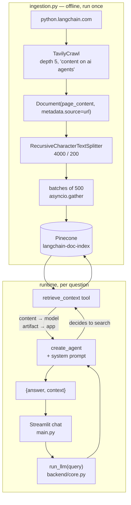

# Lesson 6 — Documentation Assistant (production-shaped RAG)

> The capstone of the LangChain half: crawl an entire documentation site, index it concurrently, expose retrieval **as a tool** to an agent, and put a Streamlit chat UI with source citations on top.

| | |
|---|---|
| **Entry points** | [`ingestion.py`](ingestion.py) (run once) → [`main.py`](main.py) (Streamlit) |
| **Backend** | [`backend/core.py`](backend/core.py) |
| **Concepts** | Web crawling, `RecursiveCharacterTextSplitter`, async batched indexing, **agentic RAG**, `content_and_artifact` tools, source citation, Streamlit `session_state` |
| **Requires** | `OPENAI_API_KEY`, `PINECONE_API_KEY`, `TAVILY_API_KEY` |
| **Cost** | Ingestion is the expensive part: crawling + embedding thousands of chunks |

---

## 1. What changes versus lesson 5

Lesson 5 was RAG on rails: *always* retrieve, *always* with the user's raw question, *always* exactly once. Real assistants need more:

| | Lesson 5 (RAG gist) | Lesson 6 (this) |
|---|---|---|
| Corpus | one local `.txt` | a whole crawled website |
| Chunking | `CharacterTextSplitter`, no overlap | `RecursiveCharacterTextSplitter`, 200 overlap |
| Indexing | one synchronous call | async, batched, concurrent, fault-tolerant |
| Retrieval | hard-wired in the chain | **a tool the agent chooses to call** |
| Query used | the user's words, verbatim | rewritten by the model |
| Number of retrievals | exactly 1 | 0, 1 or many |
| Sources | not tracked | carried end-to-end and displayed |
| Interface | `print()` | Streamlit chat |

That fourth row is the conceptual leap: **agentic RAG**. Retrieval becomes an action the model decides to take, so it can reformulate a vague question into a good search query, search several times to cover a multi-part question, or skip retrieval entirely when you just say "hi".

## 2. Architecture



## 3. Files

| File | Role |
|---|---|
| `ingestion.py` | Crawl → chunk → embed → index, asynchronously. |
| `backend/core.py` | `run_llm(query) -> {"answer", "context"}` — the RAG brain. |
| `backend/__init__.py` | Makes `backend` an importable package. |
| `logger.py` | ANSI-coloured console logging with zero dependencies. |
| `main.py` | Streamlit chat UI with a collapsible **Sources** panel. |

## 4. `ingestion.py` — the pipeline

### 4.1 SSL on macOS

```python
ssl_context = ssl.create_default_context(cafile=certifi.where())
os.environ["SSL_CERT_FILE"] = certifi.where()
os.environ["REQUESTS_CA_BUNDLE"] = certifi.where()
```

macOS ships a Python that is not wired to the system trust store, so crawling HTTPS fails with `SSLCertVerificationError`. Pointing both `requests` and the stdlib at certifi's CA bundle fixes it process-wide.

### 4.2 Crawl

```python
res = tavily_crawl.invoke({
    "url": "https://python.langchain.com/",
    "max_depth": 5,
    "extract_depth": "advanced",
    "instructions": "content on ai agents",
})
```

Three Tavily tools are instantiated in this file; only `TavilyCrawl` is used by `main()`:

| Tool | What it does |
|---|---|
| `TavilyMap` | Discovers a site's URL graph without downloading content |
| `TavilyExtract` | Pulls clean text from a **known** list of URLs |
| `TavilyCrawl` | Discovers **and** extracts in one call |

`extract_depth="advanced"` keeps code blocks, tables and structured data — essential for developer docs. `instructions` biases the crawler toward the pages you actually care about instead of the entire site.

### 4.3 Documents with provenance

```python
all_docs = [
    Document(page_content=r["raw_content"], metadata={"source": r["url"]})
    for r in res["results"] if r.get("raw_content")
]
```

`metadata["source"]` is the thread that makes citation possible: it survives chunking, is stored alongside the vector, comes back with the retrieved chunk, and ends up rendered in the Streamlit sidebar. Set it at ingestion time or you can never add it later.

### 4.4 Recursive splitting

```python
RecursiveCharacterTextSplitter(chunk_size=4000, chunk_overlap=200)
```

"Recursive" means it tries separators in order — paragraph breaks, then lines, then words, then characters — so sections and code blocks stay intact where possible. **Prefer it over `CharacterTextSplitter` for any real document.** The 200-char overlap carries context across each cut.

4000 chars is large because documentation pages need surrounding context (a code sample is useless without the prose that introduces it).

### 4.5 Concurrent indexing

```python
batches = [documents[i:i+batch_size] for i in range(0, len(documents), batch_size)]

async def add_batch(batch, n):
    try:
        await vectorStore.aadd_documents(batch)
    except Exception as e:
        log_error(...)

tasks = [add_batch(b, i) for i, b in enumerate(batches)]
results = await asyncio.gather(*tasks, return_exceptions=True)
```

- `aadd_documents` = embed + upsert, awaited, so the event loop runs other batches while this one waits on the network.
- `return_exceptions=True` means **one failing batch does not cancel the rest**; failures come back as objects and are counted for the summary.
- ⚠️ Every batch is fired at once. With a large corpus, cap concurrency with an `asyncio.Semaphore` to stay under provider rate limits — this is the first thing to add for real use.

The embedding model is configured for throughput:

```python
OpenAIEmbeddings(model="text-embedding-3-small", chunk_size=50, retry_min_seconds=10)
```

`text-embedding-3-small` is 1536-dim, ~5× cheaper than `ada-002`, and better on retrieval benchmarks. `chunk_size=50` here means *texts per HTTP request* (batching), not text length — an unfortunate name collision with the splitter's `chunk_size`. `retry_min_seconds=10` backs off on HTTP 429.

## 5. `backend/core.py` — agentic RAG

> The file opens with a large block quoted out inside `'''...'''`: an earlier, more heavily annotated draft of the same module (`k=5`, explicit `temperature=0.0`). The live implementation starts below it. Both are kept side by side for the lesson.

### 5.1 Retrieval as a tool

```python
@tool(response_format="content_and_artifact")
def retrieve_context(query: str):
    """Retrieve relevant documentation to help answer user queries about LangChain."""
    retrieved_docs = vectorstore.as_retriever().invoke(query, k=4)

    serialized = "\n\n".join(
        f"Source: {doc.metadata.get('source', 'Unknown')}\n\nContent: {doc.page_content}"
        for doc in retrieved_docs
    )
    return serialized, retrieved_docs
```

**`response_format="content_and_artifact"` is the key API in this lesson.** The tool returns a 2-tuple:

| Position | Name | Who sees it |
|---|---|---|
| `[0]` | `content` | The **model** — must be text, goes into the prompt |
| `[1]` | `artifact` | The **application** — any Python object, stored on the `ToolMessage`, never shown to the model |

That is how the raw `Document` objects survive the round-trip to the UI instead of being flattened into a prompt string. Without it you would have to re-parse source URLs out of the model's prose.

Note the source URL is embedded in the text the model reads — which is what makes the *"always cite the sources"* instruction satisfiable.

### 5.2 The agent

```python
system_prompt = (
    "You are a helpful AI assistant that answers questions about LangChain documentation. "
    "You have access to a tool that retrieves relevant documentation. "
    "Use the tool to find relevant information before answering questions. "
    "Always cite the sources you use in your answers. "
    "If you cannot find the answer in the retrieved documentation, say so."
)
agent = create_agent(model, tools=[retrieve_context], system_prompt=system_prompt)
```

Four instructions, each doing a specific job: declare the tool, mandate its use, mandate citation, and — most importantly — **grant explicit permission to fail.** "If you cannot find the answer, say so" is the highest-leverage anti-hallucination sentence in a RAG system prompt.

### 5.3 Harvesting the artifacts

```python
answer = response["messages"][-1].content

context_docs = []
for message in response["messages"]:
    if isinstance(message, ToolMessage) and hasattr(message, "artifact"):
        if isinstance(message.artifact, list):
            context_docs.extend(message.artifact)

return {"answer": answer, "context": context_docs}
```

The loop walks the **whole** transcript because an agent may search several times for a multi-part question — each search leaves its own `ToolMessage`, and all of their documents belong in the citation list.

## 6. `main.py` — the Streamlit UI

Streamlit re-runs the entire script top to bottom on every interaction. The conversation therefore cannot live in a local variable:

```python
if "messages" not in st.session_state:
    st.session_state.messages = [{"role": "assistant", "content": "...", "sources": []}]

for msg in st.session_state.messages:      # replay the whole history each rerun
    with st.chat_message(msg["role"]):
        st.markdown(msg["content"])
        if msg.get("sources"):
            with st.expander("Sources"):
                ...
```

`st.session_state` is the only object that survives a rerun. The pattern to internalise: **append to `session_state` first, render second** — the append is what persists, the render only paints the current pass.

Each message carries its own `sources` list, so citations stay attached to the answer that produced them rather than to the session as a whole.

## 7. How to run

```bash
uv run python LangChain/6.documentation-assistant/ingestion.py
```

```bash
uv run streamlit run LangChain/6.documentation-assistant/main.py
```

> **Working directory does not matter here.** Python puts the script's own directory on `sys.path[0]`, and Streamlit does the same (`streamlit/web/bootstrap.py:70`), so the sibling `logger` import and the `backend.core` package import both resolve from the repository root. Contrast with `LangGraph/1` and `LangGraph/2`, which write `graph.png` to a repo-root-relative path and therefore *must* be run from the root.

`.env` at the repository root:

```
OPENAI_API_KEY=sk-...
PINECONE_API_KEY=...
TAVILY_API_KEY=tvly-...
```

Create the Pinecone index **before** ingesting:

| Setting | Value |
|---|---|
| Name | `langchain-doc-index` (hard-coded in both files) |
| Dimension | `1536` |
| Metric | `cosine` |

## 8. Gotchas

- **Ingestion is slow and costs real money** — crawling a documentation site produces thousands of chunks, each of which gets embedded. Run it once, and start with a smaller `max_depth` while experimenting.
- **`invoke(query, k=4)` does not do what it looks like.** `k` belongs in the retriever config; passed to `invoke` it is ignored (the default happens to be 4 anyway). The explicit form is `vectorstore.as_retriever(search_kwargs={"k": 4})`.
- **The agent is rebuilt on every call.** `create_agent` compiles a graph; hoist it to module level for real traffic.
- **The index name is hard-coded** in `ingestion.py` and `core.py`. Move it to an env var before you have two corpora.
- **The app is stateless.** `run_llm` receives only the current question, so follow-ups like *"and what about the async version?"* lose their referent. Pass `st.session_state.messages` through to fix it.
- **`Chroma` is imported but unused** — the commented line next to it shows the local-persistence alternative to Pinecone.

## 9. Exercises

1. Make the assistant conversational: pass the session history into `run_llm` and into the agent's `messages`.
2. Stream the answer with `st.write_stream` and `agent.stream(...)` instead of blocking behind a spinner.
3. Build the agent once at module level and measure the latency difference.
4. Add an `asyncio.Semaphore(5)` around `add_batch` and re-run ingestion on a larger crawl.
5. Render sources as clickable links with titles by adding `title` to the metadata at ingestion time.
6. Swap Pinecone for the commented-out `Chroma(persist_directory="chroma_db")` and run the whole thing with no cloud vector DB.
7. Add a "Was this helpful?" widget and log the feedback to LangSmith.

---

**Previous:** [Lesson 5 — RAG, the gist](../5.rag-gist/README.md) · **Next:** [LangGraph — Lesson 1: ReAct agent as a graph](../../LangGraph/1.React-Agent-Function-Calling/README.md)
