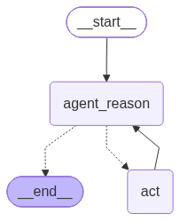
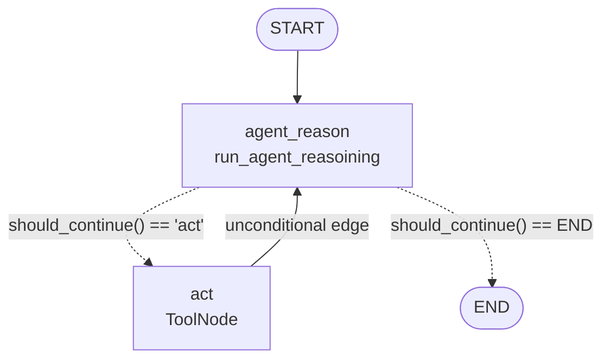

# LangGraph 1 — ReAct Agent as an Explicit Graph

> The same ReAct agent as LangChain lesson 2, except `create_agent` is gone and every node, edge and branch is declared by hand. This is the file to reread whenever a LangGraph concept stops making sense.

| | |
|---|---|
| **Entry point** | [`main.py`](main.py) |
| **Modules** | [`react.py`](react.py) (model + tools) · [`nodes.py`](nodes.py) (the two nodes) |
| **Concepts** | `StateGraph`, `MessagesState`, reducers, nodes as `state → partial state`, conditional edges, cycles, `compile()`, graph visualisation |
| **Requires** | `OPENAI_API_KEY`, `TAVILY_API_KEY` |
| **Output** |  |

---

## 1. Why a graph at all

`create_agent` is a black box that always implements the same shape: *model → tools → model → …*. The moment you need anything else — a human approval step, a validation node, two agents handing work to each other, a retry that goes somewhere different on the third failure — you need to describe the flow yourself.

LangGraph is that description language. Three primitives:

| Primitive | What it is |
|---|---|
| **State** | A typed dict shared by every node, with a *reducer* per key defining how updates merge |
| **Node** | A function `state → partial state` |
| **Edge** | Where to go next — fixed, or chosen at runtime by a router function |

Everything else in LangGraph is built out of those three.

## 2. Files

| File | Role |
|---|---|
| `react.py` | Builds the tools and the tool-bound model. No execution — kept separate to avoid circular imports. |
| `nodes.py` | The two nodes: `run_agent_reasoining` (calls the model) and `tool_node` (executes tools). |
| `main.py` | Assembles the graph, compiles it, renders `graph.png`, runs one query. |
| `graph.png` | The rendered topology, regenerated on every run. |

## 3. The graph



The dashed arrows are the conditional edge; the solid `act → agent_reason` arrow is what makes it a **cycle** — and cycles are precisely what a plain LCEL chain (a DAG) cannot express.

## 4. Code walkthrough

### 4.1 `react.py` — the equipment

```python
@tool
def triple(num: float) -> float:
    """param: num: a number to triple
       returns: the triple of the input number"""
    return float(num) * 3

tools = [TavilySearch(max_results=1), triple]
llm = ChatOpenAI(model="gpt-4o-mini", temperature=0.0).bind_tools(tools)
```

Two tools chosen for a reason: the question *"what is the weather in Tokyo? List it and then triple it"* requires **two sequential tool calls**, where the second consumes the output of the first. A one-tool example would never show the loop actually looping.

`triple` is also deterministic and arbitrary — if the answer is exactly 3× the retrieved temperature, the graph really did route through the tool node.

`temperature=0.0` because tool-argument generation should never be creative.

### 4.2 `nodes.py` — nodes are just functions

```python
def run_agent_reasoining(state: MessagesState) -> MessagesState:
    response = llm.invoke([{"role": "system", "content": SYSTEM_MESSAGE}, *state["messages"]])
    return {"messages": [response]}
```

Two rules that explain almost every LangGraph bug:

1. **A node returns a *partial* state** — only the keys it wants to update.
2. **How that partial merges is decided by the key's reducer.** For `MessagesState["messages"]` the reducer is `add_messages`, which **appends**. Returning the full list here would duplicate the entire history on every turn.

The system message is prepended at call time rather than stored in the state, so it never accumulates as the transcript grows.

```python
tool_node = ToolNode(tools=tools)
```

`ToolNode` is the prebuilt executor: it reads `.tool_calls` off the last `AIMessage`, runs each tool (in parallel when there are several), and appends one `ToolMessage` per call with the matching `tool_call_id`. It is exactly the dispatch block written by hand in LangChain lesson 4 — and unlike that version, it handles *all* the calls, not just the first.

### 4.3 `main.py` — assembling the graph

```python
flow = StateGraph(MessagesState)
```

`MessagesState` is the built-in schema, equivalent to:

```python
class MessagesState(TypedDict):
    messages: Annotated[list[AnyMessage], add_messages]
```

The `Annotated[..., add_messages]` part is the reducer. (LangGraph lesson 2 writes this out by hand.)

```python
flow.add_node(AGENT_REASON, run_agent_reasoining)
flow.set_entry_point(AGENT_REASON)          # == add_edge(START, AGENT_REASON)
flow.add_node(ACT, tool_node)
```

The router:

```python
def should_continue(state: MessagesState) -> bool:
    if not state["messages"][LAST].tool_calls:
        return END
    return ACT
```

A router **does not mutate the state**. It inspects it and returns the *name of the next node*. Here the decision is a fact, not a guess: an `AIMessage` either carries `tool_calls` or it does not.

```python
flow.add_conditional_edges(AGENT_REASON, should_continue, {END: END, ACT: ACT})
flow.add_edge(ACT, AGENT_REASON)
app = flow.compile()
```

- The third argument to `add_conditional_edges` is the **path map** (router output → node name). It is also what lets LangGraph draw the dashed branches in the diagram.
- `add_edge(ACT, AGENT_REASON)` is one line, and it is the entire loop.
- `compile()` validates the topology (unreachable nodes, missing entry point, dangling edges) and returns a **`Runnable`** — so the compiled graph supports `.invoke()`, `.stream()`, `.batch()` exactly like a chain.

### 4.4 Visualisation

```python
app.get_graph().draw_mermaid_png(output_file_path="LangGraph/1.React-Agent-Function-Calling/graph.png")
```

Renders the topology to `graph.png`. Note this **requires network access** — it calls the mermaid.ink renderer. For offline use:

```python
print(app.get_graph().draw_mermaid())     # prints mermaid source, no network
```

## 5. How to run

```bash
uv run python LangGraph/1.React-Agent-Function-Calling/main.py
```

> **Run from the repository root.** The `graph.png` path in `main.py` is relative to it. Python puts the script's own directory on `sys.path`, so the sibling imports `from react import ...` and `from nodes import ...` still resolve.

`.env` at the repository root:

```
OPENAI_API_KEY=sk-...
TAVILY_API_KEY=tvly-...
```

## 6. What happens on the sample question

> *"What is the weather in Tokyo? List it and then triple it"*

| Pass | Node | What happens |
|---|---|---|
| 1 | `agent_reason` | `AIMessage` with `tool_calls=[tavily_search(...)]` → router returns `act` |
| 1 | `act` | Tavily runs, `ToolMessage` with the weather is appended |
| 2 | `agent_reason` | Reads the temperature, emits `tool_calls=[triple(num=18)]` → router returns `act` |
| 2 | `act` | `triple` runs, `ToolMessage(54.0)` appended |
| 3 | `agent_reason` | No `tool_calls` — plain text answer → router returns `END` |

Watch it live:

```python
for chunk in app.stream({"messages": [HumanMessage(content="...")]}):
    print(chunk)
```

## 7. Gotchas

- **`run_agent_reasoining` is a typo** for *reasoning*. Harmless, but it appears in both files, so keep them in sync if you rename it.
- **`should_continue` is annotated `-> bool` but returns strings** (`END` / `"act"`). The annotation is wrong; the behaviour is correct. `-> Literal["act", "__end__"]` is the honest signature.
- **Returning the whole message list from a node duplicates history.** Always return only the new messages.
- **`draw_mermaid_png` needs network.** Use `draw_mermaid()` when offline or in CI.
- **The graph has no recursion limit override.** LangGraph's default is 25 supersteps; a pathological loop raises `GraphRecursionError` rather than running forever.

## 8. Exercises

1. Replace `.invoke()` with `.stream()` and print the node name at each step.
2. Add a third tool and a question that needs all three; confirm `ToolNode` handles parallel calls.
3. Change `should_continue` to stop after at most 2 tool rounds, counting `ToolMessage`s in the state (the pattern used in LangGraph lesson 3).
4. Add a `checkpointer=MemorySaver()` to `compile()` and invoke twice with the same `thread_id` — the agent now remembers.
5. Insert a `human_approval` node between `agent_reason` and `act` that prints the pending tool call and waits for confirmation.
6. Rebuild the same graph with a custom `TypedDict` state that also tracks `tool_call_count: int`.

---

**Previous:** [LangChain lesson 6 — Documentation assistant](../../LangChain/6.documentation-assistant/README.md) · **Next:** [LangGraph 2 — Reflection agent](../2.Reflection-Agent/README.md)
