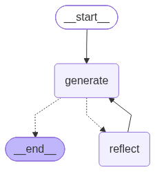
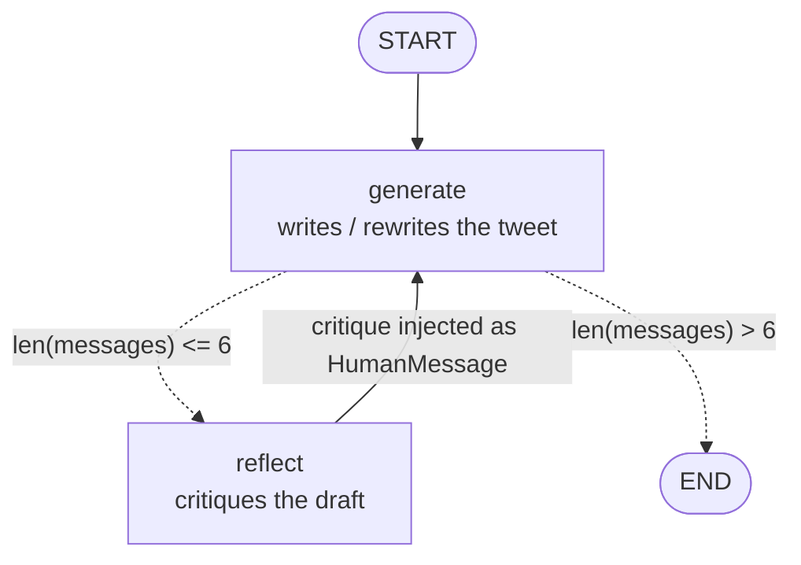

# LangGraph 2 — Reflection Agent

> Two personas, one model, one cycle: a writer drafts a tweet, a critic tears it apart, the writer rewrites. No tools, no external data — the only thing improving the output is the model reading its own work.

| | |
|---|---|
| **Entry point** | [`main.py`](main.py) |
| **Module** | [`chain.py`](chain.py) (the two prompts) |
| **Concepts** | Reflection, custom state schema, `add_messages` reducer, role re-labelling, count-based termination, cyclic graphs |
| **Requires** | `OPENAI_API_KEY` |
| **Cost** | ~6 `gpt-4o-mini` calls per run |
| **Output** |  |

---

## 1. The idea

LLMs are markedly better at **judging** text than at producing perfect text on the first try. Reflection exploits that asymmetry: generate, then criticise, then regenerate with the criticism in context.



This is the simplest useful agent that is **not** a ReAct loop, which is why it comes right after lesson 1: same machinery (`StateGraph`, conditional edge, cycle), completely different purpose.

## 2. Files

| File | Role |
|---|---|
| `chain.py` | `generate_chain` and `reflect_chain` — same model, two system prompts. |
| `main.py` | The state schema, the two nodes, the router, the graph, one run. |
| `graph.png` | Rendered topology. |

## 3. `chain.py` — two personas

```python
reflection_prompt = ChatPromptTemplate.from_messages([
    ("system",
     "You are a viral twitter influencer grading a tweet. Generate critique and recommendations for the user's tweet."
     "Always provide detailed recommendations, including requests for length, virality, style, etc."),
    MessagesPlaceholder(variable_name="messages"),
])

generation_prompt = ChatPromptTemplate.from_messages([
    ("system",
     "You are a twitter techie influencer assistant tasked with writing excellent twitter posts."
     " Generate the best twitter post possible for the user's request."
     " If the user provides critique, respond with a revised version of your previous attempts."),
    MessagesPlaceholder(variable_name="messages"),
])

llm = ChatOpenAI(model_name="gpt-4o-mini")
generate_chain = generation_prompt | llm
reflect_chain  = reflection_prompt | llm
```

Three details that make or break the loop:

- **`MessagesPlaceholder(variable_name="messages")`** injects the entire conversation after the system message. **Both chains read the same list** — that shared history is the whole mechanism: the critic sees the draft, then the writer sees the critique.
- **"Always provide detailed recommendations, including requests for length, virality, style"** — asking for *specific, actionable* notes. "Make it better" produces feedback the writer cannot act on.
- **"If the user provides critique, respond with a revised version of your previous attempts"** — the clause that turns a one-shot writer into a reviser.

One shared `llm` instance: the personas differ only by prompt, not by weights.

## 4. `main.py` — the graph

### 4.1 A hand-written state schema

```python
class MessageGraph(TypedDict):
    messages: Annotated[list[BaseMessage], add_messages]
```

This is `MessagesState` (lesson 1) written out explicitly. `Annotated[..., add_messages]` is the **reducer**: it tells LangGraph to append what a node returns rather than overwrite the list. Writing it by hand once is worth it — custom states with several keys and several reducers are where real graphs live.

### 4.2 The nodes

```python
def generation_node(state):
    return {"messages": [generate_chain.invoke({"messages": state["messages"]})]}


def reflection_node(state):
    res = reflect_chain.invoke({"messages": state["messages"]})
    return {"messages": [HumanMessage(content=res.content)]}
```

**The single most important line in this lesson is `HumanMessage(content=res.content)`.**

The critique is produced by the model — it is genuinely an `AIMessage`. But it is re-labelled as a **`HumanMessage`** before being appended. From the generator's point of view the feedback then arrives *from the user*, and models follow user instructions far more reliably than they follow their own previous assistant turns.

That role-swap trick is the practical core of reflection.

### 4.3 Termination

```python
def should_continue(state):
    if len(state["messages"]) > 6:
        return END
    return REFLECT
```

Stopping is a **message count**, not a quality judgement:

| `len(messages)` | Content | Router |
|---|---|---|
| 1 | human request | → `reflect` |
| 2 | + draft 1 | *(counted after generate)* |
| 3 | + critique 1 | → `reflect` |
| 5 | + draft 2, critique 2 | → `reflect` |
| 7 | + draft 3, critique 3 | → `END` |

So roughly three drafts and three critiques. Simple, predictable, and cheap to reason about — but it will happily keep "improving" a tweet that was already good. A production version would ask a grader model whether another pass is still worth it, or stop when the critique stops changing.

### 4.4 Wiring

```python
builder = StateGraph(state_schema=MessageGraph)
builder.add_node(GENERATE, generation_node)
builder.add_node(REFLECT, reflection_node)
builder.set_entry_point(GENERATE)            # always draft before critiquing

builder.add_conditional_edges(GENERATE, should_continue, path_map={END: END, REFLECT: REFLECT})
builder.add_edge(REFLECT, GENERATE)          # closes the cycle
graph = builder.compile()
```

Note the entry point: **generate first**. There is nothing to criticise before a draft exists.

## 5. How to run

```bash
uv run python LangGraph/2.Reflection-Agent/main.py
```

> **Run from the repository root** — the `graph.png` output path in `main.py` is relative to it.

`.env` at the repository root:

```
OPENAI_API_KEY=sk-...
```

## 6. Seeing the actual improvement

`main.py` calls `graph.invoke(input)` and assigns the result to `response`, which it never prints — so by default the run produces no visible output beyond the startup line. To watch the loop work:

```python
for event in graph.stream(input):
    for node, payload in event.items():
        print(f"\n=== {node} ===")
        print(payload["messages"][-1].content)
```

Or afterwards:

```python
for m in response["messages"]:
    print(f"[{type(m).__name__}] {m.content}\n")
```

The input is a deliberately rough tweet, typos included:

> *"@LangChainAI - newly Tool Calling feature is seriously underrated. After a ling wait, it's here…"*

Draft 1 fixes the typos. The critique asks for a hook, a concrete benefit and hashtags. Draft 2 restructures around a hook. The second critique pushes on length and call-to-action. **Reading the two critiques side by side is the real content of this lesson.**

## 7. Reflection vs Reflexion (lesson 3)

| | Reflection (this) | Reflexion (next) |
|---|---|---|
| Critique format | free-form prose | a **required schema field** |
| Grounded in new data? | no | yes — the critique produces search queries that are actually run |
| Citations | none | mandatory |
| Can it fix a factual error? | only if the model already knew | yes, by researching |
| Cost | low | high |

Reflection improves *form*. Reflexion improves *substance*.

## 8. Gotchas

- **The result is never printed.** See §6.
- **`should_continue` is annotated `-> bool` but returns node names.** The annotation is wrong; behaviour is fine.
- **`input` shadows the builtin.** Harmless here, worth avoiding.
- **Context grows every turn** — six messages of tweets and critiques all get re-sent on each call. Trivial for tweets, expensive for long documents.
- **No `temperature` is set,** so the model's default (1.0) applies. Lower it if drafts vary too wildly between runs.

## 9. Exercises

1. Print each draft and critique with `graph.stream()` (§6).
2. Change the termination to *"stop when the critique contains the word EXCELLENT"* and add that instruction to the reflection prompt.
3. Give the critic a scoring rubric (`clarity /10, hook /10, virality /10`) and stop once every score is ≥ 8.
4. Keep the critique as an `AIMessage` instead of re-labelling it, and compare how much less the writer changes.
5. Add a third node — a fact checker — between reflect and generate.
6. Reuse the whole loop for a different medium (a commit message, a product description) by swapping only the two system prompts.

---

**Previous:** [LangGraph 1 — ReAct agent as a graph](../1.React-Agent-Function-Calling/README.md) · **Next:** [LangGraph 3 — Reflexion agent](../3.Reflexion-Agent/README.md)
