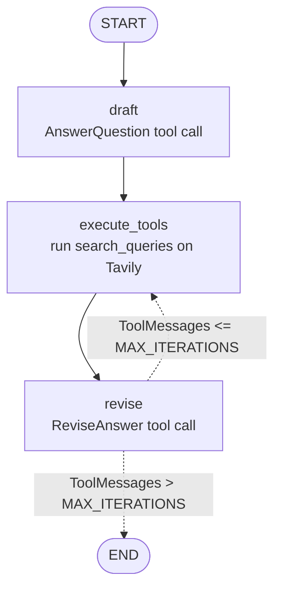

# LangGraph 3 — Reflexion Agent

> Reflection with teeth. The critique is no longer an opinion the model may ignore: it is a **required field of a forced tool call**, it must come with search queries, those queries are actually executed against the web, and the revision must carry numbered citations.

| | |
|---|---|
| **Entry point** | [`main.py`](main.py) |
| **Modules** | [`schemas.py`](schemas.py) · [`chains.py`](chains.py) · [`tool_executor.py`](tool_executor.py) |
| **Concepts** | Forced tool calls (`tool_choice`), schemas as behavioural constraints, self-generated research plans, grounded revision, `ToolNode` over non-tools, iteration counting |
| **Requires** | `OPENAI_API_KEY`, `TAVILY_API_KEY` |
| **Cost** | High — `gpt-4-turbo` + up to 3 Tavily searches per round |
| **Paper** | [Reflexion: Language Agents with Verbal Reinforcement Learning (arXiv:2303.11366)](https://arxiv.org/abs/2303.11366) |

> ⚠️ **This lesson does not run as committed.** Two defects are documented in §7 with exact fixes. Read that section before running anything.

---

## 1. The architecture



Three nodes, one cycle. `draft → execute_tools → revise` always runs at least once; only the edge leaving `revise` is conditional.

The loop the agent performs on itself:

| Step | What the model must produce |
|---|---|
| **Answer** | a ~250-word answer |
| **Self-critique** | what is *missing*, what is *superfluous* |
| **Research plan** | 1–3 search queries that would fix the critique |
| *(the graph runs those queries)* | |
| **Revision** | a new answer that absorbs the results, with numbered citations, still ≤ 250 words |

## 2. Files

| File | Role |
|---|---|
| `schemas.py` | `Reflection`, `AnswerQuestion`, `ReviseAnswer` — the contract the actor must fill. |
| `chains.py` | The actor: `first_responder` (drafts) and `revisor` (revises), from one shared prompt template. |
| `tool_executor.py` | The `ToolNode` that runs the model's self-generated queries on Tavily. |
| `main.py` | The graph, the loop counter, one run. |

## 3. `schemas.py` — schemas as behavioural constraints

```python
class Reflection(BaseModel):
    missing: str      = Field(description="Critique of what is missing.")
    superfluous: str  = Field(description="Critique of what is superfluous.")


class AnswerQuestion(BaseModel):
    """Answer the question."""
    answer: str                 = Field(description="~250 word ansert to the question.")
    reflection: Reflection      = Field(description="Your reflection on the answer.")
    search_queries: List[str]   = Field(description="1-3 search queries for researching improvements ...")


class ReviseAnswer(AnswerQuestion):
    """Revise the answer based on the critique and new information."""
    references: List[str]       = Field(description="References for the revised answer in the form of URLs.")
```

**This is the central idea of the whole lesson.** In LangGraph lesson 2 the model was *asked* to reflect and could produce something shallow. Here `reflection` and `search_queries` are **required fields of the schema the model is forced to emit** — it is structurally incapable of returning an answer without also returning its own critique and a plan to fix it.

Two further design choices worth copying:

- **`Reflection` is two-sided** — `missing` *and* `superfluous`. Asking only "what's missing" makes every revision longer than the last; the `superfluous` field is what keeps the answer inside its word budget across rounds.
- **`ReviseAnswer` inherits from `AnswerQuestion`** and adds mandatory `references`. So revisions keep critiquing themselves (the loop can continue) while additionally becoming verifiable.

The class name matters: it becomes the **tool name**, which is why `tool_executor.py` registers its executor under exactly `"AnswerQuestion"` and `"ReviseAnswer"`.

## 4. `chains.py` — the actor

One template, two instantiations:

```python
actor_prompt_template = ChatPromptTemplate.from_messages([
    ("system", """You are expert researcher.
Current time: {time}

1. {first_instruction}
2. Reflect and critique your answer. Be severe to maximize improvement.
3. Recommend search queries to research information and improve your answer."""),
    MessagesPlaceholder(variable_name="messages"),
    ("system", "Answer the user's question above using the required format."),
]).partial(time=lambda: datetime.datetime.now().isoformat())
```

- **`{first_instruction}`** is the single slot that turns this template into either the drafter (*"Answer in ~250 words"*) or the revisor (the long revision policy).
- **`.partial(time=lambda: ...)`** — a *callable* partial, re-evaluated on every `invoke()`. Passing `datetime.now().isoformat()` directly would freeze the timestamp at import time.
- **The trailing system message** repeats the format requirement in last position, where it is least likely to be lost in a long transcript.
- **"Be severe to maximize improvement"** — without an explicit push toward severity, self-critique degenerates into self-congratulation.

The revisor:

```python
revisor = actor_prompt_template.partial(
    first_instruction=revise_instructions,
) | llm.bind_tools(tools=[ReviseAnswer], tool_choice="ReviseAnswer")
```

**`tool_choice="ReviseAnswer"` forces that specific tool.** The model cannot answer in prose; it must emit a valid `ReviseAnswer` payload. That is what makes the whole pipeline deterministic in shape.

`revise_instructions` encodes the policy: add what was missing, cut what was superfluous, cite everything with `[1] https://…`, and stay under 250 words.

`gpt-4-turbo` is used rather than `gpt-4o-mini` — reflexion only works if the critic is strong enough to produce a critique worth acting on.

## 5. `tool_executor.py` — running the model's own research plan

```python
def run_queries(search_queries: list[str], **kargs):
    """Run the generated queries."""
    return tavily_tool.batch([{"query": query} for query in search_queries])

execute_tools = ToolNode([
    StructuredTool.from_function(run_queries, name=AnswerQuestion.__name__),
    StructuredTool.from_function(run_queries, name=ReviseAnswer.__name__),
])
```

The clever part: `AnswerQuestion` and `ReviseAnswer` **are not real tools** — they are output schemas. But the model emits them *as tool calls*, so LangGraph looks for a node able to service a call named `"AnswerQuestion"`.

So `run_queries` is registered **twice, under both schema names**, and ignores every field of the payload except `search_queries`:

- `**kargs` swallows `answer`, `reflection`, `references` — they are part of the tool-call payload but irrelevant here, and without it the call would raise `TypeError`.
- `.batch()` runs the 1–3 queries concurrently instead of serially.

`ToolNode` dispatches strictly by name, hence both registrations are required: the draft node emits `AnswerQuestion`, the revise node emits `ReviseAnswer`.

## 6. `main.py` — the loop

```python
MAX_ITERATIONS = 2

def event_loop(state: MessagesState):
    count_tol_visits = sum(isinstance(item, ToolMessage) for item in state["messages"])
    if count_tol_visits > MAX_ITERATIONS:
        return END
    return "execute_tools"
```

Progress is measured by **counting `ToolMessage`s** — one per research round appended by `execute_tools`. There is no quality gate: the agent stops when its research budget is spent. Each round costs one `gpt-4-turbo` call plus up to three searches, so raising `MAX_ITERATIONS` gets expensive quickly.

```python
builder.add_conditional_edges("revise", event_loop, ["execute_tools", END])
```

The path map is given as a **list** here (a dict in lessons 1–2) — allowed when the router already returns exact node names.

Extracting the answer is unusual, and worth understanding:

```python
last_message = res["messages"][-1]
if isinstance(last_message, AIMessage) and last_message.tool_calls:
    print(last_message.tool_calls[0]["args"]["answer"])
```

The final message is a **forced `ReviseAnswer` tool call, not prose** — so the answer lives inside the call arguments and has to be dug out by hand. That is the price of forcing structure on every single turn.

## 7. ⚠️ Known issues

Both were reproduced against the versions pinned in this repo (`langchain-core 1.6.0`, `langgraph 1.2.11`, Python 3.12).

### 7.1 Relative import in a script-level module

[`chains.py`](chains.py) does:

```python
from .schemas import AnswerQuestion, ReviseAnswer
```

but `main.py` imports it as a top-level module (`from chains import ...`), so the relative import has no package to resolve against:

```
ImportError: attempted relative import with no known parent package
```

`tool_executor.py` already uses the absolute form. **Fix:**

```python
from schemas import AnswerQuestion, ReviseAnswer
```

### 7.2 `first_responder` is a rendered prompt, not a chain

[`chains.py`](chains.py) builds the drafter as:

```python
first_responder = first_responder_prompt_template.format_prompt(
    tools=[AnswerQuestion], tool_choice="AnswerQuestion"
)
```

`format_prompt()` **renders** a template into a `PromptValue`; it does not bind tools. `tools=` and `tool_choice=` are silently treated as template variables, and because the required `messages` variable is not supplied the call fails at import time:

```
KeyError: 'messages'
```

`main.py` even carries a workaround for the consequences — `first_responder if hasattr(first_responder, "invoke") else first_responder | revisor` — but a `PromptValue` supports neither `.invoke` nor `|`, so it cannot help.

**Fix** — build it the same way `revisor` is built (and the same way the `__main__` block at the bottom of `chains.py` correctly does it):

```python
first_responder = first_responder_prompt_template | llm.bind_tools(
    tools=[AnswerQuestion], tool_choice="AnswerQuestion"
)
```

`draft_node` then collapses to:

```python
def draft_node(state: MessagesState) -> MessagesState:
    return {"messages": [first_responder.invoke({"messages": state["messages"]})]}
```

### 7.3 No `__main__` guard

`main.py` calls `graph.invoke(...)` at module level, so **importing the file triggers a full, paid agent run** as a side effect. Wrap the bottom of the file in `if __name__ == "__main__":`.

## 8. How to run

Apply the fixes in §7.1 and §7.2 first, then:

```bash
uv run python LangGraph/3.Reflexion-Agent/main.py
```

Smoke-test just the actor, without the graph:

```bash
uv run python LangGraph/3.Reflexion-Agent/chains.py
```

`.env` at the repository root:

```
OPENAI_API_KEY=sk-...
TAVILY_API_KEY=tvly-...
```

## 9. The sample question

> *"Write about AI-Powered SOC / autonomous soc problem domain, list startups that do that and raised capital."*

Chosen because it is **impossible to answer well from parametric memory**: funding rounds are recent, specific and verifiable. The first draft will be vague and probably name companies with no amounts. The critique will say exactly that. The searches will fetch the actual rounds. The revision will name amounts with `[1] [2]` citations.

Print the reflection at each round to see the mechanism:

```python
for m in res["messages"]:
    if isinstance(m, AIMessage) and m.tool_calls:
        args = m.tool_calls[0]["args"]
        print("MISSING:    ", args["reflection"]["missing"])
        print("SUPERFLUOUS:", args["reflection"]["superfluous"])
        print("QUERIES:    ", args["search_queries"], "\n")
```

## 10. Reflection vs Reflexion, side by side

| | LangGraph 2 (Reflection) | LangGraph 3 (Reflexion) |
|---|---|---|
| Critique | free-form prose, optional in practice | required schema field, structurally enforced |
| New information | none | Tavily search on model-generated queries |
| Citations | none | mandatory `references` |
| Fixes factual errors? | only from what it already knew | yes |
| Termination | message count | `ToolMessage` count |
| Model | `gpt-4o-mini` | `gpt-4-turbo` |
| Cost per run | low | high |

## 11. Exercises

1. Apply the §7 fixes and get a full run to complete.
2. Print the reflections and queries per round (§9) and check whether round 2's critique is genuinely harsher than round 1's.
3. Raise `MAX_ITERATIONS` to 4 and judge whether the extra two rounds actually improved the answer.
4. Add a `confidence: float` field to `Reflection` and terminate once it exceeds 0.8 — a quality gate instead of a budget.
5. Enforce the word limit in code (count words in `answer`, feed a violation back as a `ToolMessage`) instead of trusting the prompt.
6. Swap Tavily for the RAG retriever from LangChain lesson 6 to build a *reflexive documentation assistant*.
7. Downgrade to `gpt-4o-mini` and observe how much shallower the self-critique becomes.

---

**Previous:** [LangGraph 2 — Reflection agent](../2.Reflection-Agent/README.md) · **Back to:** [course README](../../README.md)
