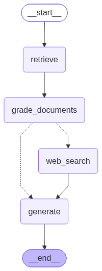
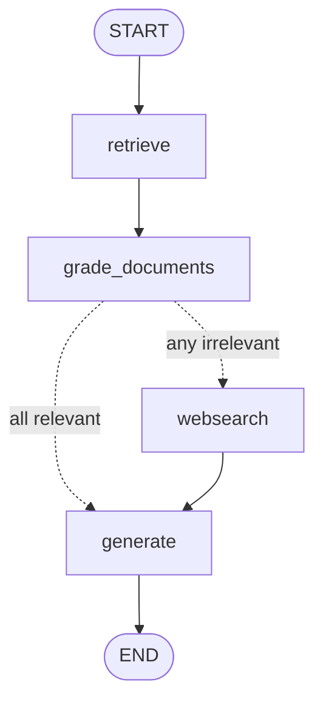

# 4.1 — Corrective RAG (CRAG)

> Never trust similarity search. Grade every retrieved chunk, throw away the bad ones, and if anything was thrown away, top the context up from the web before answering.

**Part of [LangGraph lesson 4 — Agentic RAG](../README.md)** · Next variant: [2. Self-RAG](../2.self_rag/README.md)

| | |
|---|---|
| **Entry point** | [`main.py`](main.py) |
| **Paper** | [Corrective Retrieval Augmented Generation — arXiv:2401.15884](https://arxiv.org/abs/2401.15884) |
| **Adds vs plain RAG** | a relevance grader + a web-search fallback |
| **LLM calls / question** | **5** (4 grading + 1 generation) |
| **Requires** | `OPENAI_API_KEY`, `TAVILY_API_KEY` |

---

## The graph





Linear, with exactly one branch. The whole "corrective" idea lives in `grade_documents` and the router that reads its verdict.

<br clear="right">

## What problem this solves

A retriever always returns its top-*k*, even when the corpus contains nothing on the topic — cosine similarity measures **closeness**, not **usefulness**. Plain RAG then answers from whatever came back, and the failure is silent.

CRAG inserts a judge between retrieval and generation.

## The three pieces

### 1. The grader chain — [`graph/chains/retrieval_grader.py`](graph/chains/retrieval_grader.py)

```python
class GradeDocuments(BaseModel):
    """Binary score for relevance check on retrieved documents."""
    binary_score: str = Field(description="Documents are relevant to the question, 'yes' or 'no'")

structured_llm_grader = llm.with_structured_output(GradeDocuments)
retrieval_grader = grade_prompt | structured_llm_grader
```

`with_structured_output` binds the schema as a forced tool call and parses the reply back into a `GradeDocuments` instance. No output parser, no regex, no "sometimes the model writes a sentence instead of `yes`".

This is the template every other judge in the lesson copies: a one-field Pydantic model, `temperature=0`, and a system prompt with exactly one job.

### 2. The grading node — [`graph/nodes/grade_documents.py`](graph/nodes/grade_documents.py)

```python
for d in documents:
    score = retrieval_grader.invoke({"question": question, "document": document_text})
    if grade.lower() == "yes":
        filtered_docs.append(d)
    else:
        web_search = True          # one bad chunk is enough
        continue
return {"documents": filtered_docs, "question": question, "web_search": web_search}
```

Two things worth noticing:

- **One LLM call per document.** With the default top-4 retriever that is 4 extra calls on every single question — the dominant cost of this graph, and it scales linearly with `k`.
- **`web_search` flips on the *first* irrelevant chunk.** Strict by design: the assumption is that a gap in the corpus is better filled from the web than papered over by the chunks that survived.

### 3. The router — [`graph/graph.py`](graph/graph.py)

```python
def decide_to_generate(state):
    if state["web_search"]:
        return WEB_SEARCH
    return GENERATE
```

Cheap: it reads a boolean the previous node already computed. No LLM call. Contrast with the router in variant 2, which makes up to two.

## The fallback — [`graph/nodes/web_search.py`](graph/nodes/web_search.py)

Tavily's top-3 results are joined and wrapped in **one** synthetic `Document`, then appended to whatever survived grading — so `generate` sees local knowledge and fresh web knowledge in the same context.

Two deliberate simplifications, both worth fixing as exercises:

- the raw user question is used as the search query, with no rewriting;
- the result URLs are discarded, so the final answer cannot cite its web sources.

## What it still cannot do

**Nothing inspects the answer.** If `generate` hallucinates, or produces something grounded but off-target, this graph ships it and returns `END`. Closing that gap is exactly what [variant 2](../2.self_rag/README.md) does.

## Running it

```bash
cd "LangGraph/4.Agentic-RAG/1.standard_rag" && uv run python main.py
```

Run from **inside this folder**: `graph` and `ingestion` are imported as top-level modules, and `PERSIST_DIRECTORY = "./.chroma_db"` resolves against the working directory.

The first run scrapes the three Lilian Weng posts and builds `.chroma_db`; later runs reuse it.

### Reading the output

Every node prints a banner, so the console is the trace:

```
--- RETRIEVE NODE ---
---CHECK DOCUMENT RELEVANCE TO QUESTION---
---GRADE: DOCUMENT RELEVANT---
---GRADE: DOCUMENT NOT RELEVANT---
--- ASSESS GRADED DOCUMENTS ---
--- DECISION: NOT ALL DOCUMENTS ARE NOT RELEVANT TO QUESTION, INCLUDE WEB SEARCH---
--- RUNNING WEB SEARCH ---
---GENERATE---
```

Try `"What is agent memory?"` (in the corpus — expect all-relevant, no web search) against something off-topic (expect the fallback to fire).

## ⚠️ Known issues

| Where | Symptom | Fix |
|---|---|---|
| [`graph/chains/tests/test_chains.py`](graph/chains/tests/test_chains.py) | imports `graph.chains.router`, which only exists in variant 3 → `ModuleNotFoundError`, so **no test in the file runs** | delete the import — neither `question_router` nor `RouteQuery` is used here |
| [`graph/chains/generation.py`](graph/chains/generation.py) | `ChatOpenAI(temperature=0)` with no `model=` silently defaults to **gpt-3.5-turbo**, while variants 2–3 pin `gpt-4o-mini` for the same chain | add `model="gpt-4o-mini"` before comparing answer quality across variants |
| [`graph/graph.py`](graph/graph.py) | `draw_mermaid_png` uses an absolute, machine-specific path and calls mermaid.ink at import time | build the path from `__file__`, or use `draw_mermaid()` |
| [`graph/state.py`](graph/state.py) | `documents: List[str]` actually holds `Document` objects | annotate `List[Document]` and drop the `isinstance` guards |
| [`ingestion.py`](ingestion.py) | `vectorstore._collection.count()` uses a private Chroma attribute | `len(vectorstore.get()["ids"])`, or a sentinel file |

## Tests

```bash
cd "LangGraph/4.Agentic-RAG/1.standard_rag" && uv run pytest . -s -v
```

*(fix the import above first, or collection fails)*

Two calibration tests, positive and negative control: the same document must grade `yes` against `"agent memory"` and `no` against `"how to make pizza"`. A judge that always says `yes` passes the first and fails the second — which is the whole point of testing it both ways.

---

**Lesson overview:** [LangGraph 4 — Agentic RAG](../README.md) · **Next:** [2. Self-RAG](../2.self_rag/README.md)
