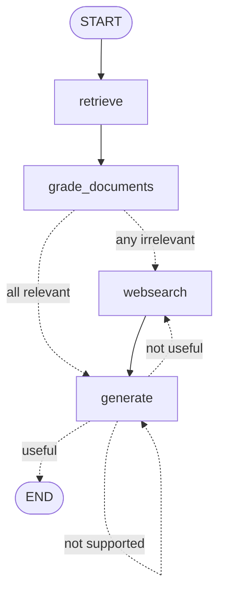

# 4.2 — Self-RAG

> Everything Corrective RAG does, plus the graph now grades its **own answer** before letting it out — twice, in a fixed order, with two different failure routes.

**Part of [LangGraph lesson 4 — Agentic RAG](../README.md)** · Previous: [1. Corrective RAG](../1.standard_rag/README.md) · Next: [3. Adaptive RAG](../3.adaptive_rag/README.md)

| | |
|---|---|
| **Entry point** | [`main.py`](main.py) |
| **Paper** | [Self-RAG: Learning to Retrieve, Generate, and Critique through Self-Reflection — arXiv:2310.11511](https://arxiv.org/abs/2310.11511) |
| **Adds vs variant 1** | `hallucination_grader` + `answer_grader` on the edge leaving `generate` |
| **LLM calls / question** | **7** minimum (4 grading + 1 generation + 2 answer grading), more on every retry |
| **Requires** | `OPENAI_API_KEY`, `TAVILY_API_KEY` |

---

## The graph




The nodes are identical to variant 1. **Only the edges changed** — `generate` is no longer terminal, it now leads to a three-way decision, two branches of which go *backwards*. That cycle is why this cannot be an LCEL chain.

<br clear="right">

## The two gates

Variant 1 closed the *retrieval* failure mode. Two more remain:

| Failure | Caught by |
|---|---|
| The answer is **not grounded** in the documents (hallucination) | `hallucination_grader` |
| The answer is grounded but **misses the question** | `answer_grader` |

Both are evaluated inside a single router, [`graph/graph.py`](graph/graph.py):

```python
def grade_generation_grounded_in_documents_and_question(state) -> str:
    score = hallucination_grader.invoke({"documents": documents, "generation": generation})
    if score.binary_score:                                  # gate 1: grounded?
        score = answer_grader.invoke({"question": question, "generation": generation})
        if score.binary_score:                              # gate 2: on-target?
            return "useful"
        return "not useful"
    return "not supported"
```

**The order is not arbitrary.** Groundedness is checked first, so a fluent hallucination is rejected before anyone asks whether it is useful. Reversing the two would let a confident invention pass gate 2 on style.

Note also that this router costs **one or two LLM calls every time it runs** — unlike `decide_to_generate`, which just reads a boolean. It is the expensive part of this graph.

## The two judges see different things

| Chain | Receives | Answers |
|---|---|---|
| [`hallucination_grader`](graph/chains/hallucination_grader.py) | `{documents}` + `{generation}` | is this supported by the facts? |
| [`answer_grader`](graph/chains/answer_grader.py) | `{question}` + `{generation}` — **not the documents** | does this resolve the question? |

Withholding the documents from the answer grader is deliberate: it cannot be impressed by how well-sourced the answer looks, and judges relevance to the question alone.

Both type `binary_score` as a real `bool`, so `graph.py` branches on it directly — cleaner than variant 1's `str` + `.lower() == "yes"` comparison.

Note what the hallucination grader is *not* asked: nothing about truth in the world, only about support by `{documents}`. **Groundedness is checkable; truth is not.**

## The three outcomes

```python
workflow.add_conditional_edges(
    GENERATE,
    grade_generation_grounded_in_documents_and_question,
    {
        "not supported": GENERATE,   # hallucinated -> try again
        "useful": END,               # grounded and on-target -> done
        "not useful": WEB_SEARCH,    # grounded but off-target -> get more evidence
    },
)
```

The routing logic behind `"not useful"` is the subtle one: the answer *is* faithful to its context, so regenerating from that same context would produce the same miss. The fix has to be more evidence, not another attempt — hence `WEB_SEARCH` rather than `GENERATE`.

> ⚠️ **There is no attempt counter.** A model that keeps hallucinating loops `generate → generate` until LangGraph's recursion limit (default 25) raises `GraphRecursionError`. Bounding it is the first exercise.

## Running it

```bash
cd "LangGraph/4.Agentic-RAG/2.self_rag" && uv run python main.py
```

Run from **inside this folder** — `graph` and `ingestion` are top-level modules, and `./.chroma_db` resolves against the working directory.

### Reading the output

The self-critique adds its own banners after generation:

```
---GENERATE---
---CHECK HALLUCINATIONS---
---DECISION: GENERATION IS GROUNDED IN DOCUMENTS---
---GRADE GENERATION vs QUESTION---
---DECISION: GENERATION ADDRESSES QUESTION---
```

To see the loop actually fire, force a failure: temporarily raise the generation model's `temperature`, or shrink the retriever's `k` to 1 so the context is too thin to answer from.

## ⚠️ Known issues

| Where | Symptom | Fix |
|---|---|---|
| [`graph/graph.py`](graph/graph.py) | `add_edge(GENERATE, END)` is redundant with the conditional edge that already maps `"useful" → END` | harmless — verified that the retry loop still iterates and the extra edge is folded into the branch map — but it is dead wiring; delete it so `graph.png` stays honest |
| [`graph/graph.py`](graph/graph.py) | `draw_mermaid_png` uses an absolute, machine-specific path and calls mermaid.ink at import time | build the path from `__file__`, or use `draw_mermaid()` |
| [`graph/chains/tests/test_chains.py`](graph/chains/tests/test_chains.py) | passes `docs` (a list of `Document`) as `{context}`, not the joined string the real `generate` node builds | join it the way the node does, or the test is not exercising the real path |
| [`graph/state.py`](graph/state.py) | `documents: List[str]` actually holds `Document` objects | annotate `List[Document]` and drop the `isinstance` guards |
| [`ingestion.py`](ingestion.py) | `vectorstore._collection.count()` uses a private Chroma attribute | `len(vectorstore.get()["ids"])`, or a sentinel file |

## Tests

```bash
cd "LangGraph/4.Agentic-RAG/2.self_rag" && uv run pytest . -s -v
```

Beyond variant 1's retrieval-grader controls, two more calibrate gate 1:

| Test | Checks |
|---|---|
| `test_hallucination_grader_answer_yes` | an answer actually generated **from** these documents grades as grounded |
| `test_hallucination_grader_answer_no` | *"In order to make pizza we need to first start with the dough"* against the same documents grades as **not** grounded |

The second is the one that matters — it proves the judge is not a rubber stamp.

---

**Previous:** [1. Corrective RAG](../1.standard_rag/README.md) · **Lesson overview:** [LangGraph 4 — Agentic RAG](../README.md) · **Next:** [3. Adaptive RAG](../3.adaptive_rag/README.md)
