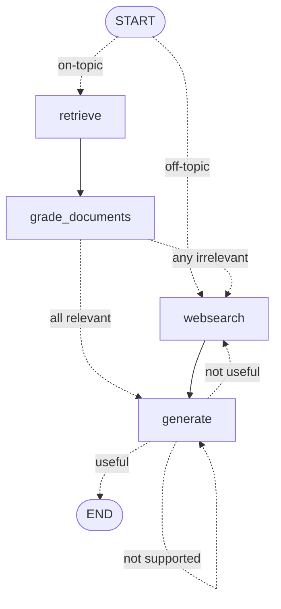

# 4.3 — Adaptive RAG

> Everything Self-RAG does, plus one decision taken **before any work happens**: is this question even answerable from our corpus? If not, skip retrieval entirely.

**Part of [LangGraph lesson 4 — Agentic RAG](../README.md)** · Previous: [2. Self-RAG](../2.self_rag/README.md)

| | |
|---|---|
| **Entry point** | [`main.py`](main.py) |
| **Paper** | [Adaptive-RAG: Learning to Adapt Retrieval-Augmented LLMs through Question Complexity — arXiv:2403.14403](https://arxiv.org/abs/2403.14403) |
| **Adds vs variant 2** | a datasource `router` wired as the graph's **conditional entry point** |
| **LLM calls / question** | **8** on-topic · **4** off-topic (retrieval and doc grading skipped) |
| **Requires** | `OPENAI_API_KEY`, `TAVILY_API_KEY` |

---

## The graph




Still the same four nodes. The one structural change is at the top: `START` now branches.

<br clear="right">

## The change: a conditional entry point

```python
# variant 2
workflow.set_entry_point(RETRIEVE)

# variant 3
workflow.set_conditional_entry_point(
    route_question,
    {WEB_SEARCH: WEB_SEARCH, RETRIEVE: RETRIEVE},
)
```

`route_question` runs **before any node**, so an off-topic question never touches the vector store. That saves the retrieval *plus one grading call per retrieved chunk* — with the default top-4 retriever, four LLM calls per question that variant 2 would have spent proving the corpus was irrelevant.

That saving is the whole meaning of "adaptive": match the amount of machinery to the question.

## The router — [`graph/chains/router.py`](graph/chains/router.py)

```python
class RouteQuery(BaseModel):
    """Route a user query to the most relevant datasource."""
    datasource: Literal["vectorstore", "websearch"] = Field(
        ..., description="Given a user question choose to route it to web search or vectorstore."
    )

llm = ChatOpenAI(model="gpt-4o", temperature=0)
question_router = route_prompt | llm.with_structured_output(RouteQuery)
```

- **`Literal` makes the two options part of the JSON schema**, so the model structurally cannot return a third value.
- **`"websearch"` is spelled to match `consts.WEB_SEARCH`.** That is what lets `route_question` compare `source.datasource == WEB_SEARCH` against a node name directly, with no translation layer.
- **`gpt-4o`, not `gpt-4o-mini`.** This single call decides the shape of the entire run, so a mistake here is the expensive kind — every other judge in the lesson uses the cheap model.

### The system prompt is corpus documentation

```
The vectorstore contains documents related to agents, prompt engineering, and adversarial attacks.
Use the vectorstore for questions on these topics. For all else, use web-search.
```

The model has no other way of knowing what was ingested. **Change the URLs in [`ingestion.py`](ingestion.py) and this sentence must change with them**, or the router starts misrouting silently — no error, just quietly worse answers. The two router tests exist to catch exactly that drift.

## A one-word change forced from three files away

```python
# graph/nodes/web_search.py
documents = state.get("documents")   # variants 1-2: state["documents"]
```

Entering the graph *at* `websearch` means no `retrieve` step ever populated that key, so subscript access would raise `KeyError`. A routing decision made in `graph.py` leaks into a node's implementation — a small but honest illustration of how graph topology and node code are coupled.

## Running it

```bash
cd "LangGraph/4.Agentic-RAG/3.adaptive_rag" && uv run python main.py
```

Run from **inside this folder** — `graph` and `ingestion` are top-level modules, and `./.chroma_db` resolves against the working directory.

### The demonstration

`main.py` ships with the off-topic question active and the on-topic one commented out. Run both:

```python
app.invoke({"question": "What is agent memory?"})   # --- ROUTE QUESTION TO RAG ---
app.invoke({"question": "How to make pizza?"})      # --- ROUTE QUESTION TO WEB SEARCH ---
```

The second run **never prints `--- RETRIEVE NODE ---`**, and never prints a single `---GRADE: DOCUMENT ...---` line. That absence is the entire value of this variant — compare the two consoles side by side.

## ⚠️ Known issues

| Where | Symptom | Fix |
|---|---|---|
| [`graph/graph.py`](graph/graph.py) | `add_edge(GENERATE, END)` is redundant with the conditional edge that already maps `"useful" → END` | harmless — verified that the retry loop still iterates and the extra edge is folded into the branch map — but it is dead wiring; delete it so `graph.png` stays honest |
| [`graph/graph.py`](graph/graph.py) | `draw_mermaid_png` uses an absolute, machine-specific path and calls mermaid.ink at import time | build the path from `__file__`, or use `draw_mermaid()` |
| [`graph/graph.py`](graph/graph.py) | no retry counter on the `generate → generate` loop | add `retries: int` to `GraphState` and give up after 2 |
| [`graph/state.py`](graph/state.py) | `documents: List[str]` actually holds `Document` objects | annotate `List[Document]` and drop the `isinstance` guards |
| [`ingestion.py`](ingestion.py) | `vectorstore._collection.count()` uses a private Chroma attribute | `len(vectorstore.get()["ids"])`, or a sentinel file |

## Tests

```bash
cd "LangGraph/4.Agentic-RAG/3.adaptive_rag" && uv run pytest . -s -v
```

| Test | Checks |
|---|---|
| `test_router_to_vectorstore` | `"agent memory"` — inside the corpus — routes to `vectorstore` |
| `test_router_to_websearch` | `"how to make pizza"` — outside it — routes to `websearch` |

These two are the cheapest possible guard against the corpus and the router prompt drifting apart. If you re-ingest a different set of URLs, they should be the first thing that fails.

> Note this variant's test file drops the hallucination-grader tests from variant 2 rather than adding to them. Merging both sets would give full coverage of every judge in the graph.

---

**Previous:** [2. Self-RAG](../2.self_rag/README.md) · **Lesson overview:** [LangGraph 4 — Agentic RAG](../README.md)
