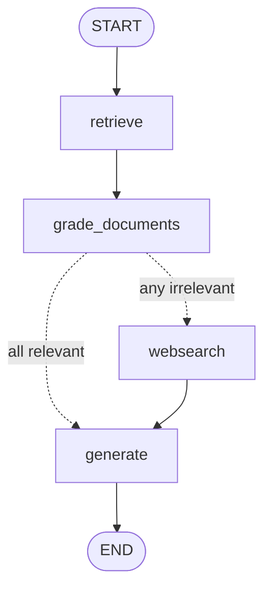
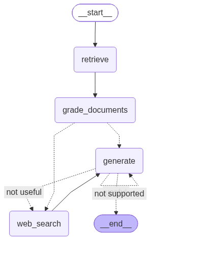
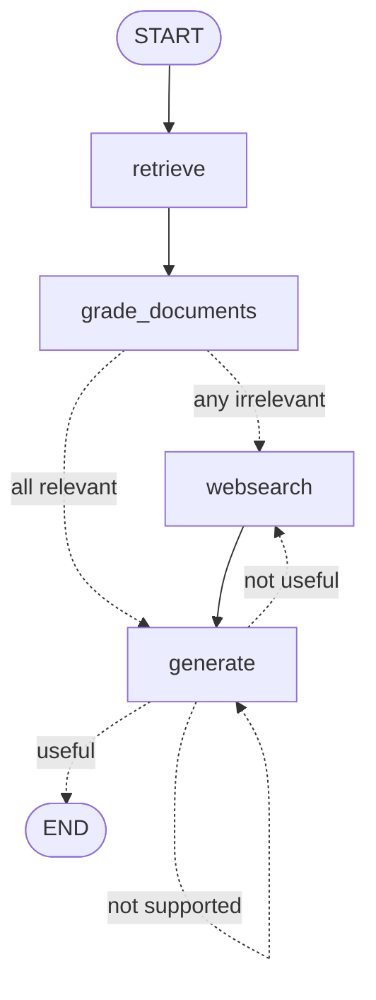
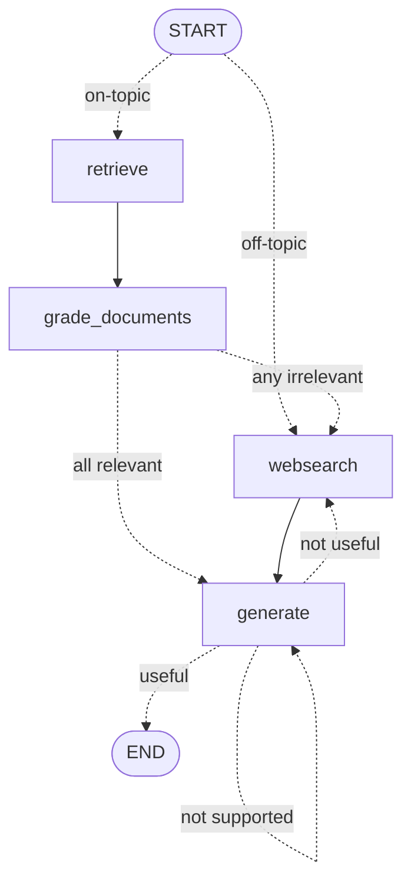

# LangGraph 4 — Agentic RAG: Corrective → Self → Adaptive

> Three graphs over the same corpus, each adding one more layer of quality control until the pipeline stops trusting *anything* by default: not the retriever, not the generator, not even the premise that retrieval was the right move.

| | |
|---|---|
| **Variants** | [1. Corrective RAG](1.standard_rag/README.md) · [2. Self-RAG](2.self_rag/README.md) · [3. Adaptive RAG](3.adaptive_rag/README.md) — each has its own README |
| **Concepts** | LLM-as-a-judge, `with_structured_output`, conditional entry points, self-correction cycles, local Chroma, corpus-aware routing |
| **Requires** | `OPENAI_API_KEY`, `TAVILY_API_KEY` |
| **Cost** | 5–8+ LLM calls **per question** — see the [cost table](#7-what-each-variant-costs) |
| **Papers** | [CRAG (2401.15884)](https://arxiv.org/abs/2401.15884) · [Self-RAG (2310.11511)](https://arxiv.org/abs/2310.11511) · [Adaptive-RAG (2403.14403)](https://arxiv.org/abs/2403.14403) |

---

## 1. What's wrong with plain RAG

LangChain lessons 5 and 6 built the standard pipeline: embed the question, take the nearest chunks, answer from them. It has four independent failure modes, and none of them announce themselves:

| # | Failure | Why it happens |
|---|---|---|
| A | Retrieved chunks are **irrelevant** | Cosine similarity measures *closeness*, not *usefulness*. The top-4 always come back, even when the corpus contains nothing on the topic. |
| B | The answer is **not grounded** in them | Nothing forces the generator to stay inside the context it was handed. |
| C | The answer is grounded but **misses the question** | Right documents, wrong aspect of them. |
| D | The question was **never answerable** from this corpus | The pipeline retrieves and grades anyway, paying for both. |

Each variant closes one more:

| | Fixes | Adds | Nodes | Edges |
|---|---|---|---|---|
| **1. Corrective RAG** | A | grade each chunk, web-search fallback | 4 | linear + 1 branch |
| **2. Self-RAG** | A, B, C | grade the *answer* twice, loop back on failure | 4 | + a 3-way cycle |
| **3. Adaptive RAG** | A, B, C, D | route the question *before* retrieving | 4 | + conditional entry |

**The four nodes never change.** Only the wiring does — which is exactly why this belongs in LangGraph and not in LCEL.

## 2. Shared foundation

All three variants are self-contained copies sharing the same skeleton:

```
<variant>/
├── README.md               that variant's own walkthrough
├── main.py                 entry point: invoke the graph once
├── ingestion.py            build/reuse the local Chroma index, export `retriever`
├── .chroma_db/             persisted vectors (created on first run)
├── graph.png               rendered topology, rewritten on every import
└── graph/
    ├── consts.py           node-name constants
    ├── state.py            GraphState TypedDict
    ├── graph.py            ← the only file that really differs between variants
    ├── nodes/              retrieve · grade_documents · generate · web_search
    └── chains/             generation + the LLM-as-a-judge chains
        └── tests/          calibration tests for each judge
```

### The corpus

Three Lilian Weng posts — agents, prompt engineering, adversarial attacks — chunked at **250 tokens** (`RecursiveCharacterTextSplitter.from_tiktoken_encoder`, so the budget is real tokens, not characters) and stored in a local **Chroma** index. No cloud vector DB, no cost after the first ingestion.

The narrowness is the design: *"agent memory"* is unambiguously inside the corpus, *"how to make pizza"* is unambiguously outside. Without that clean boundary, none of the graders or the router would have a decidable question to answer.

Ingestion runs as an **import side effect** of `ingestion.py`, guarded by `if vectorstore._collection.count() == 0`, so it happens exactly once.

### The state — note what is missing

```python
class GraphState(TypedDict):
    question: str
    generation: str
    web_search: bool
    documents: List[str]
```

**No `Annotated[..., reducer]` anywhere.** Unlike `MessagesState` in LangGraph lessons 1–3, every node here *overwrites* the keys it returns. That is why `retrieve`, `grade_documents` and `generate` all echo `question` back in their return dicts — it is not redundancy, it is the contract.

### The four nodes

| Node | Does | Deliberately does not |
|---|---|---|
| `retrieve` | embeds the question, pulls the top-4 chunks | judge them |
| `grade_documents` | one yes/no LLM call **per chunk**; drops the bad ones; sets `web_search` | rewrite the query |
| `generate` | joins the surviving chunks into `{context}` and answers | check its own answer *(variants 2–3 do that on the edge)* |
| `web_search` | Tavily top-3, collapsed into **one** synthetic `Document`, appended | keep the source URLs |

---

## 3. Variant 1 — Corrective RAG

📄 **Full walkthrough: [`1.standard_rag/README.md`](1.standard_rag/README.md)**




### The grader

```python
class GradeDocuments(BaseModel):
    """Binary score for relevance check on retrieved documents."""
    binary_score: str = Field(description="Documents are relevant to the question, 'yes' or 'no'")

structured_llm_grader = llm.with_structured_output(GradeDocuments)
retrieval_grader = grade_prompt | structured_llm_grader
```

`with_structured_output` binds the schema as a forced tool call and parses the reply back into a `GradeDocuments` instance — no output parser, no regex, no "sometimes the model writes a sentence instead of yes".

### The correction

```python
def decide_to_generate(state):
    if state["web_search"]:
        return WEB_SEARCH
    return GENERATE
```

`web_search` is `True` as soon as **one** chunk was graded irrelevant. Strict by design: the assumption is that a gap in the corpus is better filled from the web than papered over by the chunks that survived.

### What it still cannot do

Nothing inspects the answer. If `generate` hallucinates or drifts off-topic, this graph ships it.

<br clear="right">

## 4. Variant 2 — Self-RAG

📄 **Full walkthrough: [`2.self_rag/README.md`](2.self_rag/README.md)**





Everything CRAG does, plus **two sequential gates on the edge leaving `generate`**:

```python
def grade_generation_grounded_in_documents_and_question(state) -> str:
    score = hallucination_grader.invoke({"documents": documents, "generation": generation})
    if score.binary_score:                                   # gate 1: grounded?
        score = answer_grader.invoke({"question": question, "generation": generation})
        if score.binary_score:                               # gate 2: on-target?
            return "useful"
        return "not useful"
    return "not supported"
```

**Order matters.** An ungrounded answer is rejected before anyone asks whether it is useful — a fluent hallucination would otherwise sail through gate 2.

The two judges are deliberately given different inputs:

| Judge | Sees | Answers |
|---|---|---|
| `hallucination_grader` | `{documents}` + `{generation}` | is this supported by the facts? |
| `answer_grader` | `{question}` + `{generation}` — **not the documents** | does this resolve the question? |

Withholding the documents from the answer grader is the point: it cannot be impressed by how well-sourced the answer looks.

### The three outcomes

| Verdict | Goes to | Reasoning |
|---|---|---|
| `not supported` | `generate` | hallucinated — same context, try again |
| `not useful` | `websearch` | grounded but off-target; regenerating from the same context would not help, so widen the evidence |
| `useful` | `END` | done |

> ⚠️ **No attempt counter.** A model that keeps hallucinating loops `generate → generate` until LangGraph's recursion limit (default 25) raises `GraphRecursionError`. Adding a `retries: int` to the state is the first exercise below.

<br clear="right">

## 5. Variant 3 — Adaptive RAG

📄 **Full walkthrough: [`3.adaptive_rag/README.md`](3.adaptive_rag/README.md)**




One structural change: `set_entry_point(RETRIEVE)` becomes a **conditional entry point**.

```python
class RouteQuery(BaseModel):
    datasource: Literal["vectorstore", "websearch"] = Field(...)

workflow.set_conditional_entry_point(route_question, {WEB_SEARCH: WEB_SEARCH, RETRIEVE: RETRIEVE})
```

The router runs *before any node*, so an off-topic question never touches the vector store — saving the retrieval plus one grading call per chunk.

Two details that make it work:

- **The `Literal` matches `consts.WEB_SEARCH`.** `"websearch"` is both a valid schema value and the node name, which is what lets `route_question` compare `source.datasource == WEB_SEARCH` directly.
- **`web_search.py` had to change** from `state["documents"]` to `state.get("documents")`. Entering the graph *at* `websearch` means no `retrieve` ever populated that key. A one-word change forced by a routing decision made three files away — a good illustration of how graph topology leaks into node code.

### The router prompt is corpus documentation

```
The vectorstore contains documents related to agents, prompt engineering, and adversarial attacks.
Use the vectorstore for questions on these topics. For all else, use web-search.
```

The model has no other way of knowing what was ingested. **Change the URLs in `ingestion.py` and this sentence must change with them**, or the router starts misrouting silently. The two router tests exist precisely to catch that drift.

`gpt-4o` is used here rather than the graders' `gpt-4o-mini`: this single call decides the shape of the entire run.

<br clear="right">

---

## 6. The recurring pattern: LLM-as-a-judge

Four chains, one shape — a tiny Pydantic schema, `with_structured_output`, and a system prompt with exactly one job:

| Chain | Input | Schema field | Used at |
|---|---|---|---|
| `retrieval_grader` | `{document}`, `{question}` | `binary_score: str` | inside `grade_documents`, once per chunk |
| `hallucination_grader` | `{documents}`, `{generation}` | `binary_score: bool` | edge out of `generate`, gate 1 |
| `answer_grader` | `{question}`, `{generation}` | `binary_score: bool` | edge out of `generate`, gate 2 |
| `router` | `{question}` | `datasource: Literal[...]` | conditional entry point |

All run at `temperature=0` — a judge must be reproducible.

> Note the inconsistency: `retrieval_grader` types its verdict as `str` (compared with `.lower() == "yes"`), the other two use a real `bool`. The `bool` version is cleaner and removes the string comparison entirely.

## 7. What each variant costs

Per question, assuming the default top-4 retriever and no retries:

| Variant | Router | Doc grading | Generation | Answer grading | **Total LLM calls** | Search |
|---|---|---|---|---|---|---|
| 1. Corrective | — | 4 | 1 | — | **5** | 0–1 |
| 2. Self-RAG | — | 4 | 1 | 2 | **7** | 0–1 |
| 3. Adaptive *(on-topic)* | 1 | 4 | 1 | 2 | **8** | 0–1 |
| 3. Adaptive *(off-topic)* | 1 | — | 1 | 2 | **4** | 1 |

Every `not supported` retry adds one generation plus one-to-two grading calls. Document grading dominates: it scales linearly with `k`, so raising the retriever's `k` to 10 makes every question cost 10 grader calls.

## 8. Running it

Each variant is independent. **Run from inside its folder** — `graph` and `ingestion` are imported as top-level modules, and `PERSIST_DIRECTORY = "./.chroma_db"` resolves against the working directory:

```bash
cd "LangGraph/4.Agentic-RAG/1.standard_rag" && uv run python main.py
```

```bash
cd "LangGraph/4.Agentic-RAG/2.self_rag" && uv run python main.py
```

```bash
cd "LangGraph/4.Agentic-RAG/3.adaptive_rag" && uv run python main.py
```

The calibration tests (real API calls, so they cost money):

```bash
cd "LangGraph/4.Agentic-RAG/3.adaptive_rag" && uv run pytest . -s -v
```

`.env` at the repository root:

```
OPENAI_API_KEY=sk-...
TAVILY_API_KEY=tvly-...
```

The first run of any variant scrapes the three URLs and builds `.chroma_db`; every run after that reuses it.

### What to watch

Every node prints a banner, so the console *is* the trace. Run variant 3 twice:

```python
app.invoke({"question": "What is agent memory?"})   # --- ROUTE QUESTION TO RAG ---
app.invoke({"question": "How to make pizza?"})      # --- ROUTE QUESTION TO WEB SEARCH ---
```

The second one never prints `--- RETRIEVE NODE ---`. That skipped line is the entire value of Adaptive RAG.

## 9. ⚠️ Known issues

Reproduced against the pinned versions (`langgraph 1.2.11`, `langchain-core 1.6.0`, Python 3.12). Each is flagged with a comment at the site.

| Where | Symptom | Fix |
|---|---|---|
| [`1.standard_rag/graph/chains/tests/test_chains.py`](1.standard_rag/graph/chains/tests/test_chains.py) | imports `graph.chains.router`, which only exists in variant 3 → `ModuleNotFoundError`, **no test in the file runs** | delete the import; neither `question_router` nor `RouteQuery` is used there |
| [`1.standard_rag/graph/chains/generation.py`](1.standard_rag/graph/chains/generation.py) | `ChatOpenAI(temperature=0)` with no `model=` silently defaults to **gpt-3.5-turbo**, while variants 2–3 pin `gpt-4o-mini` for the same chain | add `model="gpt-4o-mini"` before comparing answers across variants |
| `2.self_rag` / `3.adaptive_rag` `graph/graph.py` | `add_edge(GENERATE, END)` is redundant with the conditional edge that already maps `"useful" → END` | harmless (verified: the retry loop still iterates, the edge is folded into the branch map) but dead wiring — delete it so `graph.png` stays honest |
| all three `graph/graph.py` | `draw_mermaid_png` uses an **absolute machine-specific path**, and runs a network call to mermaid.ink at import time | build the path from `__file__`, or use `draw_mermaid()` for offline text |
| `graph/state.py` | `documents: List[str]` actually holds `Document` objects; nodes work around it with `isinstance(d, str)` checks | annotate `List[Document]` and drop the guards |
| `ingestion.py` | `vectorstore._collection.count()` reaches into a private Chroma attribute | `len(vectorstore.get()["ids"])`, or a sentinel file |
| `2.self_rag/.../test_chains.py` | passes `docs` (a list) as `{context}`, not the joined string the real `generate` node builds | join it the same way the node does, or the test is not exercising the real path |
| [`pyproject.toml`](../../pyproject.toml) | `pytest` is not declared, it only happens to be present transitively | add it as a dev dependency |

## 10. Exercises

1. **Bound the retry loop.** Add `retries: int` to `GraphState`, increment it in `generate`, and return `"useful"` (or a dedicated `"give up"` branch) once it exceeds 2.
2. **Add a query-rewriting node** between `grade_documents` and `web_search` — searching the raw user question is leaving quality on the table.
3. **Keep the source URLs.** `web_search` discards them; carry them through and cite them in the answer, as LangChain lesson 6 does.
4. **Make the web results per-result Documents** instead of one blob, so the relevance grader can judge them individually.
5. **Batch the document grading.** Four sequential LLM calls is the dominant cost — `retrieval_grader.batch([...])` runs them concurrently.
6. **Break the router on purpose:** ingest a different set of URLs without touching the router's system prompt, then run the two router tests and watch them fail.
7. **Swap in a local model** via `ChatOllama` for the graders only, and measure how much judgement quality you lose against how much cost you save.
8. **Merge all three.** The variants are copies; factor the shared `nodes/`, `chains/` and `state.py` into one package and keep only three `graph.py` files.

---

**Previous:** [LangGraph 3 — Reflexion agent](../3.Reflexion-Agent/README.md) · **Back to:** [course README](../../README.md)
